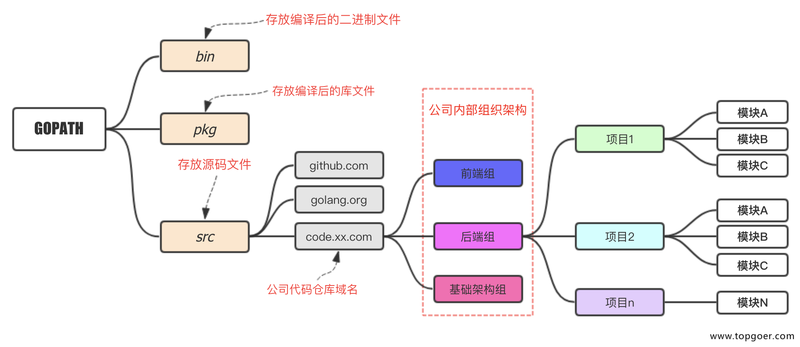

# 开始学习Go
[TOC]

## go的独特之处
**它的主要目标是“兼具Python 等动态语言的开发速度和C/C++等编译型语言的性能与安全性”**

### 为并发而生
Go语言的并发是基于 goroutine 的，goroutine 类似于线程，但并非线程。可以将 goroutine 理解为一种虚拟线程。Go 语言运行时会参与调度 goroutine，并将 goroutine 合理地分配到每个 CPU 中，最大限度地使用CPU性能。开启一个goroutine的消耗非常小（大约2KB的内存），你可以轻松创建数百万个goroutine。

goroutine的特点：

    1.`goroutine`具有可增长的分段堆栈。这意味着它们只在需要时才会使用更多内存。
    2.`goroutine`的启动时间比线程快。
    3.`goroutine`原生支持利用channel安全地进行通信。
    4.`goroutine`共享数据结构时无需使用互斥锁。


### 优势
**简单易学**：

- 语法简洁
  - 其语法在C语言的基础上进行了大幅的简化，去掉了不需要的表达式括号，循环也只有 for 一种表示方法，就可以实现数值、键值等各种遍历。
- 代码风格统一
- 开发效率高
  - Go语言实现了开发效率与执行效率的完美结合，让你像写Python代码（效率）一样编写C代码（性能）。


**自带GC**


**静态编译**


**简单的思想，没有继承，多态，类等**

### go适合做什么
* 服务端开发
* 分布式系统，微服务
* 网络编程
* 区块链开发
* 内存KV数据库，例如boltDB、levelDB
* 云平台


广泛用于人工智能、云计算开发、容器虚拟化、⼤数据开发、数据分析及科学计算、运维开发、爬虫开发、游戏开发等领域。


### 主要特征
1.自动立即回收。
2.更丰富的内置类型。
3.函数多返回值。
4.错误处理。
5.匿名函数和闭包。
6.类型和接口。
7.并发编程。
8.反射。
9.语言交互性。


### 一些go独有的特点

1. 函数可以返回任意数量的返回值
```go
package main

import "fmt"

func swap(x, y string) (string, string, string) {
	return y, x, x + y
}

func main() {
	a, b, c := swap("hello", "world")
	fmt.Println(a, b, c)
}
```

2. 短变量声明：在函数中，简洁赋值语句 := 可在类型明确的地方代替 var 声明。

函数外的每个语句都必须以关键字开始（var, func 等等），因此 := 结构不能在函数外使用

```go
package main

import "fmt"

func main() {
	var i, j int = 1, 2
	k := 3
	c, python, java := true, false, "no!"

	fmt.Println(i, j, k, c, python, java)
}
```

3. 可见性
1）声明在函数内部，是函数的本地值，类似private
2）声明在函数外部，是对当前包可见(包内所有.go文件都可见)的全局值，类似protect
3）声明在函数外部且首字母大写是所有包可见的全局值,类似public.
>如果类型/接口/方法/函数/字段的首字母大写，则是 Public 的，对其他 package 可见，如果首字母小写，则是 Private 的，对其他 package 不可见。


## 经常疑惑的点

### GOPATH

- 下载的第三方包源代码文件放在$GOPATH/src目录下， 
- 产生的二进制可执行文件放在 $GOPATH/bin目录下，
- 生成的中间缓存文件会被保存在 $GOPATH/pkg 下

### 包 package
- go 里面一个目录为一个package, 一个package级别的func, type, 变量, 常量, 这个package下的所有文件里的代码都可以随意访问, 不需要首字母大写
- **同目录**下的两个文件如hello.go和hello2.go中的package 定义的名字要是同一个，不同的话，是会报错的 ==> 所以main方法要单独放一个文件

### init函数和main函数
**init函数**： 用于包(package)的初始化
    1 init函数是用于程序执行前做包的初始化的函数，比如初始化包里的变量等

    2 每个包可以拥有多个init函数

    3 包的每个源文件也可以拥有多个init函数

    4 同一个包中多个init函数的执行顺序go语言没有明确的定义(说明)

    5 不同包的init函数按照包导入的依赖关系决定该初始化函数的执行顺序

    6 init函数不能被其他函数调用，而是在main函数执行之前，自动被调用


**main函数**：Go语言程序的默认入口函数(主函数)
func main(){ 
	//body
}


**异同**：
- 相同点：
    - 两个函数在定义时不能有任何的参数和返回值，且Go程序自动调用。
- 不同点：
    - init可以应用于任意包中，且可以重复定义多个。
    - main函数只能用于main包中，且只能定义一个。


**执行顺序**：
* 对同一个go文件的init()调用顺序是从上到下的。

* 对同一个package中不同文件是按文件名字符串比较“从小到大”顺序调用各文件中的init()函数。

* 对于不同的package，如果不相互依赖的话，按照main包中"先import的后调用"的顺序调用其包中的init()，如果package存在依赖，则先调用最早被依赖的package中的init()，最后调用main函数。

* 如果init函数中使用了println()或者print()你会发现在执行过程中这两个不会按照你想象中的顺序执行。这两个函数官方只推荐在测试环境中使用，对于正式环境不要使用


# 《build-web-application-with-golang》
>https://github.com/astaxie/build-web-application-with-golang/blob/master/zh/01.3.md

## Go命令

```go
The commands are:

        bug         start a bug report
        build       compile packages and dependencies
        clean       remove object files and cached files
        doc         show documentation for package or symbol
        env         print Go environment information
        fix         update packages to use new APIs
        fmt         gofmt (reformat) package sources
        generate    generate Go files by processing source
        get         add dependencies to current module and install them
        install     compile and install packages and dependencies
        list        list packages or modules
        mod         module maintenance
        work        workspace maintenance
        run         compile and run Go program
        test        test packages
        tool        run specified go tool
        version     print Go version
        vet         report likely mistakes in packages

Use "go help <command>" for more information about a command.

Additional help topics:

        buildconstraint build constraints
        buildmode       build modes
        c               calling between Go and C
        cache           build and test caching
        environment     environment variables
        filetype        file types
        go.mod          the go.mod file
        gopath          GOPATH environment variable
        gopath-get      legacy GOPATH go get
        goproxy         module proxy protocol
        importpath      import path syntax
        modules         modules, module versions, and more
        module-get      module-aware go get
        module-auth     module authentication using go.sum
        packages        package lists and patterns
        private         configuration for downloading non-public code
        testflag        testing flags
        testfunc        testing functions
        vcs             controlling version control with GOVCS

Use "go help <topic>" for more information about that topic.
```

### go build
目的：用于编译代码。在包的编译过程中，若有必要，会同时编译与之相关联的包。

**命令介绍**

* 如果是普通包，就像我们在1.2节中编写的mymath包那样，当你执行go build之后，它不会产生任何文件。如果你需要在$GOPATH/pkg下生成相应的文件，那就得执行go install。

* 如果是main包，当你执行go build之后，它就会在当前目录下生成一个可执行文件。如果你需要在$GOPATH/bin下生成相应的文件，需要执行go install，或者使用go build -o 路径/a.exe。

* 如果某个项目文件夹下有多个文件，而你只想编译某个文件，就可在go build之后加上文件名，例如go build a.go；go build命令默认会编译当前目录下的所有go文件。

* 你也可以指定编译输出的文件名。例如1.2节中的mathapp应用，我们可以指定go build -o astaxie.exe，
  * 默认情况是你的package名(非main包)，或者是第一个源文件的文件名(main包)。
  * 默认生成的可执行文件名是文件夹名。）
* go build会忽略目录下以“_”或“.”开头的go文件。
* go build的时候会选择性地编译以系统名结尾的文件（Linux、Darwin、Windows、Freebsd）。例如Linux系统下面编译只会选择array_linux.go文件,其它系统命名后缀文件全部忽略，例如array_windows.go。


**参数的介绍**
-o 指定输出的文件名，可以带上路径，例如 go build -o a/b/c
-i 安装相应的包，编译+go install
-a 更新全部已经是最新的包的，但是对标准包不适用
-n 把需要执行的编译命令打印出来，**但是不执行**，这样就可以很容易的知道底层是如何运行的
-p n 指定可以并行可运行的编译数目，默认是CPU数目
-race 开启编译的时候自动检测数据竞争的情况，目前只支持64位的机器
-v 打印出来我们正在编译的包名
-work 打印出来编译时候的临时文件夹名称，并且如果已经存在的话就不要删除
-x 打印出来执行的命令，其实就是和-n的结果类似，只是这个会执行
-ccflags 'arg list' 传递参数给5c, 6c, 8c 调用
-compiler name 指定相应的编译器，gccgo还是gc
-gccgoflags 'arg list' 传递参数给gccgo编译连接调用
-gcflags 'arg list' 传递参数给5g, 6g, 8g 调用
-installsuffix suffix 为了和默认的安装包区别开来，采用这个前缀来重新安装那些依赖的包，-race的时候默认已经是-installsuffix race,大家可以通过-n命令来验证
-ldflags 'flag list' 传递参数给5l, 6l, 8l 调用
-tags 'tag list' 设置在编译的时候可以适配的那些tag

### go clean
目的：**移除当前源码包和关联源码包里面编译生成的文件**


这些文件包括：
```
_obj/            旧的object目录，由Makefiles遗留
_test/           旧的test目录，由Makefiles遗留
_testmain.go     旧的gotest文件，由Makefiles遗留
test.out         旧的test记录，由Makefiles遗留
build.out        旧的test记录，由Makefiles遗留
*.[568ao]        object文件，由Makefiles遗留

DIR(.exe)        由go build产生
DIR.test(.exe)   由go test -c产生
MAINFILE(.exe)   由go build MAINFILE.
```


常用于清除编译文件，然后GitHub递交源码，在本机测试的时候这些编译文件都是和系统相关的，但是对于源码管理来说没必要。


`go clean -i -n`

**参数介绍**

-i 清除关联的安装的包和可运行文件，也就是通过go install安装的文件
-n 把需要执行的清除命令打印出来，但是不执行，这样就可以很容易的知道底层是如何运行的
-r 循环的清除在import中引入的包
-x 打印出来执行的详细命令，其实就是-n打印的执行版本


### go fmt <文件名>.go
- **格式化代码文档**，不符合标准格式编译不通过。 
- 一般编译器都支持保存时自动格式化，背后就是调用go fmt，而go fmt就是调用的gofmt
- 需要参数-w，否则格式化结果不会写入文件
- gofmt -w -l src，可以格式化整个项目。


gofmt的**参数介绍**

-l 显示那些需要格式化的文件
-w 把改写后的内容直接写入到文件中，而不是作为结果打印到标准输出。
-r 添加形如“a[b:len(a)] -> a[b:]”的重写规则，方便我们做批量替换
-s 简化文件中的代码
-d 显示格式化前后的diff而不是写入文件，默认是false
-e 打印所有的语法错误到标准输出。如果不使用此标记，则只会打印不同行的前10个错误。
-cpuprofile 支持调试模式，写入相应的cpufile到指定的文件


### go get
目的：**动态获取远程代码包**


- 目前支持的有BitBucket、GitHub、Google Code和Launchpad，需要安装对应的源码管理工具，且加入环境变量，比如安装了Git。
- 这个命令在内部实际上分成了两步操作：
  - 第一步是下载源码包
  - 第二步是执行go install
- 其实go get支持自定义域名的功能，具体参见go help remote。


**参数介绍**：

-d 只下载不安装
-f 只有在你包含了-u参数的时候才有效，不让-u去验证import中的每一个都已经获取了，这对于本地fork的包特别有用
-fix 在获取源码之后先运行fix，然后再去做其他的事情
-t 同时也下载需要为运行测试所需要的包
-u 强制使用网络去更新包和它的依赖包
-v 显示执行的命令


### go install
实际执行了2步：
- 第一步是生成结果文件(可执行文件或者.a包)，一般就是build，所以支持build的编译参数。
- 第二步会把编译好的结果移到$GOPATH/pkg或者$GOPATH/bin。


### go test
目的：自动读取源码目录下面名为`*_test.go`的文件，生成并运行测试用的可执行文件. 默认不需要任何参数。


常用的**参数**：
-bench regexp 执行相应的benchmarks，例如 -bench=.
-cover 开启测试覆盖率
-run regexp 只运行regexp匹配的函数，例如 -run=Array 那么就执行包含有Array开头的函数
-v 显示测试的详细命令


### go tool
go tool下面下载聚集了很多命令，常用fix和vet

- go tool fix . 用来修复以前老版本的代码到新版本，例如go1之前老版本的代码转化到go1,例如API的变化
- go tool vet directory|files 用来分析当前目录的代码是否都是正确的代码
  >例如是不是调用fmt.Printf里面的参数不正确，例如函数里面提前return了然后出现了无用代码之类的。


### go generate
用于在编译前自动化生成某类代码。

- go generate和go build是完全不一样的命令，通过分析源码中特殊的注释，然后执行相应的命令。
- 这些命令都是很明确的，**没有任何的依赖**在里面。
- 而且大家在用这个之前心里面一定要有一个理念，**这个go generate是给你用的，不是给使用你这个包的人用的，是方便你来生成一些代码的**。


举个例子：
我们经常会使用`yacc`来生成代码，那么我们常用这样的命令：

>go tool yacc -o gopher.go -p parser gopher.y

-o 指定了输出的文件名， -p指定了package的名称。这是一个单独的命令，如果我们想让go generate来触发这个命令，那么就可以在**当前目录的任意一个xxx.go文件**里面的**任意位置**增加一行如下的注释：

>//go:generate go tool yacc -o gopher.go -p parser gopher.y

这里我们注意了，`//go:generate`是**没有任何空格**的，固定格式，在扫描源码文件的时候就是根据这个来判断的。

所以我们可以通过如下的命令来生成，编译，测试。如果gopher.y文件有修改，那么就重新执行go generate重新生成文件就好。
```
$ go generate
$ go build
$ go test
```

### godoc
目的：打印附于Go语言程序实体上的文档
- go doc已经废弃，现在是godoc。 

- go get golang.org/x/tools/cmd/godoc


通过命令在命令行执行 godoc -http=:端口号 比如godoc -http=:8080。然后在浏览器中打开127.0.0.1:8080，你将会看到一个golang.org的本地copy版本，通过它你可以查询pkg文档等其它内容。如果你设置了GOPATH，在pkg分类下，不但会列出标准包的文档，还会列出你本地GOPATH中所有项目的相关文档，这对于经常被墙的用户来说是一个不错的选择。


### 其他命令
go version 查看go当前的版本
go env 查看当前go的环境变量
go list 列出当前全部安装的package
go run 编译并运行Go程序
go fix 把Go语言源码文件中的旧版本代码修正为新版本的代码
go vet 是一个用于检查Go语言源码中静态错误的简单工具


# Go语言基础语法

##  hello world

### 关键字 25个
**关键字不能用于自定义名字，只能在特定语法结构中使用**


break    default      **func**    interface    **select**
case     **defer**        go      **map**          **struct**
**chan**     else         **goto**    package      switch
const    fallthrough  if      **range**        type
continue for          import  return       var

### 保留字 37个
这些内部预先定义的名字**并不是关键字**，你**可以在定义中重新使用它们**。在一些特殊的场景中重新定义它们也是有意义的，但是也要注意避免过度而引起语义混乱。


- Constants: true  false  iota  nil

- Types:
```
int  int8  int16  int32  int64  
uint  uint8  uint16  uint32  uint64  uintptr
float32  float64  complex128  complex64
bool  byte  rune  string  error
```

- Functions:   
```
make  len  cap  new  append  copy  close  delete
complex  real  imag
panic  recover
```

### 写个hello world
- 每一个可独立运行的Go程序，必定包含一个package main，在这个main包中必定包含一个入口函数main，而这个函数既没有参数，也没有返回值。
- Go使用package（和Python的模块类似）来组织代码。
- main.main()函数(这个函数位于主包）是每一个独立的可运行程序的入口点。
- Go使用UTF-8字符串和标识符(因为UTF-8的发明者也就是Go的发明者之一)，所以它天生支持多语言。


## 基础

### 变量
>**Go把变量类型放在变量名后面**

- 使用**var**关键字是Go最基本的定义变量方式: `var variableName type`
  - 定义多个变量: `var vname1, vname2, vname3 type`
  - 定义变量并初始化值: `var variableName type = value`
  - 同时初始化多个变量: `var vname1, vname2, vname3 type= v1, v2, v3`
- 简化定义——忽略类型：`var vname1, vname2, vname3 = v1, v2, v3`
- 再简化：`vname1, vname2, vname3 := v1, v2, v3`  
  - `:=这`个符号直接取代了var和type,这种形式叫做简短声明.
  - 只能用在函数内部；
  - 在函数外部使用则会无法编译通过，所以一般用**var**方式来定义全局变量。


- `_`（下划线）是个特殊的变量名，任何赋予它的值都会被丢弃。 **有什么用呢？后面解释**。 例如：`_, b := 34, 35`，就是丢弃34.
- Go对于已声明但未使用的变量会在编译阶段报错，比如下面的代码就会产生一个错误：声明了i但未使用。


### 常量
 **定义语法**：
```go
const constantName = value
//如果需要，也可以明确指定常量的类型：
const Pi float32 = 3.1415926 
```


**常见例子**：
```go
const Pi = 3.1415926
const i = 10000
const MaxThread = 10
const prefix = "astaxie_"
```
- Go 语言中没有枚举(enum)的概念，一般可以用常量的方式来模拟枚举。


>**特别之处**: 可以指定相当多的小数位数(例如200位)， 若指定給float32自动缩短为32bit，指定给float64自动缩短为64bit

### 内置基础类型

#### Boolean

布尔值的类型为`bool`，值是true或false，**默认**为`false`。
```go
//示例代码
var isActive bool  // 全局变量声明
var enabled, disabled = true, false  // 忽略类型的声明
func test() {
	var available bool  // 一般声明
	valid := false      // 简短声明
	available = true    // 赋值操作
}
```


#### 数值类型

- 整数分为有符号和无符号两种：
  - 有符号：int，int8, int16, int32, int64，rune（=int32）
  - 无符号：uint, uint8, uint16, uint32, uint64, byte（=uint8）
  - 
>这些类型的变量之间不允许互相赋值或操作，不然会在编译时引起编译器报错。 **没法强转嘛？**

```go
var a int8

var b int32

c:=a + b
```

- 浮点数的类型有float32和float64两种（没有float类型），默认是float64。
- 复数： complex64，complex128（64位实数+64位虚数），默认类型128。
```go
// 复数的形式为RE + IMi，其中RE是实数部分，IM是虚数部分，而最后的i是虚数单位
var c complex64 = 5+5i
//output: (5+5i)
fmt.Printf("Value is: %v", c)
```


#### 字符串
字符串是用一对双引号（`""`）或反引号（``）括起来定义，它的类型是string。

- 字符串是不可变的，下面代码会报错：cannot assign to s[0]
```go
var s string = "hello"
s[0] = 'c'
```
- 真想修改可以迂回：
```go
s := "hello"
c := []byte(s)  // 将字符串 s 转换为 []byte 类型
c[0] = 'c'
s2 := string(c)  // 再转换回 string 类型
fmt.Printf("%s\n", s2)
```
- 字符串可以做切片，用作修改
```go
s := "hello"
s = "c" + s[1:] // 字符串虽不能更改，但可进行切片操作
fmt.Printf("%s\n", s)
```
- ` 括起的字符串为Raw字符串，即字符串在代码中的形式就是打印时的形式，它没有字符转义，换行也将原样输出。下面变量输出的话也是分行的。
```go
m := `hello
	world`
```


#### array  定长数组
定义：
```go
var arr [n]type
```

读取和赋值
```go
var arr [10]int  // 声明了一个int类型的数组
arr[0] = 42      // 数组下标是从0开始的
arr[1] = 13      // 赋值操作
fmt.Printf("The first element is %d\n", arr[0])  // 获取数据，返回42
fmt.Printf("The last element is %d\n", arr[9]) //返回未赋值的最后一个元素，默认返回0
```


- 长度是数组类型的一部分，长度不同那就是不一样的类型。 长度不可改变。
- **数组之间的赋值**是值的赋值，即当把一个数组作为参数传入函数的时候，传入的其实是该数组的副本，而不是它的指针。
  - 是否可以把一个数组直接赋值给另一个数组？ 长度不一样可以不？ 一样可以不？


#### slice  动态数组
- 要创建一个长度不为 0 的空 slice，需要使用内建函数 make。 

```go
s := make([]string, 3)
```

- slice 支持内建函数 append， 该函数会返回一个包含了一个或者多个新值的 slice。 注意由于 append 可能返回一个新的 slice，我们需要接收其返回值。

#### map


#### 错误类型
Go内置有一个error类型，专门用来处理错误信息，Go的package里面还专门有一个包errors来处理错误：
```go
err := errors.New("emit macho dwarf: elf header corrupted")
if err != nil {
	fmt.Print(err)
}
```

#### 内置接口error
```go
    type error interface { //只要实现了Error()函数，返回值为String的都实现了err接口

            Error()    String

    }

```

#### 分组声明 用括号（）
同时声明多个常量、变量，或者导入多个包时，可采用分组的方式进行声明
```go
import "fmt"
import "os"

const i = 100
const pi = 3.1415
const prefix = "Go_"

var i int
var pi float32
var prefix string
```
分组规整为：
```go
import(
	"fmt"
	"os"
)

const(
	i = 100
	pi = 3.1415
	prefix = "Go_"
)

var(
	i int
	pi float32
	prefix string
)
```

#### iota枚举
这个关键字用来声明enum的时候采用，它默认开始值是0，const中每增加一行加1


目前感觉没啥卵用，先不介绍了。

### 运算符

**算数运算符**
 + 、 - 、 * 、 / 、%  没啥区别

- 注意： ++（自增）和--（自减）在Go语言中是单独的语句，并不是运算符。


**关系运算符**
 == 、 != 、 > 、>= 、 < 、 <=  ,也没啥区别


**逻辑运算符**
&&、 ll 、 ! ,好像也没啥区别，会阻断，没有单个的？单个的是位运算符


**位运算符**
位运算符对整数在内存中的二进制位进行操作， 很少用
运算符 | 描述 
---------|----------
& |	参与运算的两数各对应的二进位相与。（两位均为1才为1）
l | 参与运算的两数各对应的二进位相或。（两位有一个为1就为1）
^ | 参与运算的两数各对应的二进位相异或，当两对应的二进位相异时，结果为1。（两位不一样则为1）
<< | 左移n位就是乘以2的n次方。“a<<b”是把a的各二进位全部左移b位，高位丢弃，低位补0。
\>>	| 右移n位就是除以2的n次方。“a>>b”是把a的各二进位全部右移b位。


**赋值运算符**
没啥区别：+= 、&=

### 类型 type

#### 类型判断
```go
value, ok := interface{}(container).([]string)
```

### 控制流

#### if
- 在条件语句之前可以有一个声明语句；在这里声明的变量可以在这个语句所有的条件分支中使用。
```go
 if num := 9; num < 0 {
        fmt.Println(num, "is negative")
    } else if num < 10 {
        fmt.Println(num, "has 1 digit")
    } else {
        fmt.Println(num, "has multiple digits")
    }
```
- Go 没有三目运算符


#### for

- for循环，唯一的循环，多种形式。
```go
for initialization; condition; post {
    // zero or more statements
}
```
  - **initialization语句是可选的**，在循环开始前执行。initalization如果存在，必须是一条简单语句（simple statement），即，短变量声明、自增语句、赋值语句或函数调用。
  - condition是一个布尔表达式（boolean expression），其值在**每次循环迭代开始时计算**。如果为true则执行循环体语句。
  - post语句在**循环体执行结束后执行**，**之后再次**对condition求值。
- for循环的这三个部分每个都可以省略，如果省略initialization和post，分号也可以省略（相当于 while）：
```go
// a traditional "while" loop
for condition {
    // ...
}
```
- 省略掉condition，变成for{} ，无限循环，可以用 break，return终止。
- for循环的另一种形式，**在某种数据类型的区间（range）上遍历**，如字符串或切片。

```go
// Echo2 prints its command-line arguments.
package main

import (
    "fmt"
    "os"
)

func main() {
    s, sep := "", ""
    for _, arg := range os.Args[1:] {
        s += sep + arg
        sep = " "
    }
    fmt.Println(s)
}
```
  - 每次循环迭代，range产生**一对值**；**索引以及在该索引处的元素值**。
  - 这个例子不需要索引，但range的语法要求，要处理元素，必须处理索引
    - 一种思路是把索引赋值给一个临时变量（如temp）然后忽略它的值，但Go语言不允许使用无用的局部变量（local variables）
    - go语言提供了一种解决方案：`空标识符（blank identifier）`，即`_`（也就是下划线）。
      - 空标识符可用于在任何语法**需要变量名但程序逻辑不需要**的时候
```go
// Echo2 prints its command-line arguments.
package main

import (
	"fmt"
	"os"
	"strconv"
	"strings"
)

func main() {
	s, sep := "", ""
	for _, arg := range os.Args[1:] {
		s += sep + arg
		sep = " "
	}
	fmt.Println(s)
	fmt.Println(strings.Join(os.Args[1:], " "))
	fmt.Println("methodName:" + os.Args[0])

	for i, arg := range os.Args[1:] {
		fmt.Println(strconv.FormatInt(int64(i), 10) + ":" + arg)
	}

}
```


#### switch 多路选择
```go
switch coinflip() {
case "heads":
    heads++
case "tails":
    tails++
default:
    fmt.Println("landed on edge!")
}
```
- Go语言并不需要显式地在每一个case后写break，语言**默认**执行完case后的逻辑语句会**自动退出**。
- 如果你想要相邻的几个case都执行同一逻辑的话，需要自己显式地写上一个fallthrough语句来覆盖这种默认行为。很少用。
- 像for和if控制语句一样，switch也可以紧跟一个简短的变量声明，一个自增表达式、赋值语句，或者一个函数调用（译注：比其它语言丰富）
- **continue**会跳过内层的循环，如果我们想**跳过的是更外层**的循环的话，我们可以在**相应的位置加上label**
>类似goto，但这种行为更多地被用到机器生成的代码中

- Go语言里的switch还可以**不带操作对象**（译注：switch不带操作对象时默认用true值代替，然后将每个case的表达式和true值进行比较）。不带表达式的 switch 是实现 if/else 逻辑的另一种方式。 
```go
  func Signum(x int) int {
    switch {
    case x > 0:
        return +1
    default:
        return 0
    case x < 0:
        return -1
    }
}
```
- 在同一个 case 语句中，你可以使用逗号来分隔多个表达式。
```go
switch time.Now().Weekday() {
    case time.Saturday, time.Sunday:
        fmt.Println("It's the weekend")
    default:
        fmt.Println("It's a weekday")
    }
```

- 类型开关 (type switch) 比较类型而非值。可以用来发现一个接口值的类型。 在这个例子中，变量 t 在每个分支中会有相应的类型。

```go
 whatAmI := func(i interface{}) {
        switch t := i.(type) {
        case bool:
            fmt.Println("I'm a bool")
        case int:
            fmt.Println("I'm an int")
        default:
            fmt.Printf("Don't know type %T\n", t)
        }
    }
    whatAmI(true)
    whatAmI(1)
    whatAmI("hey")
```


#### 标签和跳转
Go语言使用标签（Lable）来标识一个语句的位置，用于goto、break、continue语句的跳转，语法如下：
```go
Lable:Statemaent
```
- goto语句用于函数内部的跳转，需要配合标签一起使用：
```go
    //跳转到标签后的语句执行
  goto Lable
```
- goto只能在函数内跳转
- goto语句不能跳过内部变量声明语句，这些变量在goto语句的标签语句处又是可见的。
- goto语句只能跳到同级作用于或者上层作用域，不能跳到内部作用域。


- break
  - 用于跳出for、switch、select语句的执行，单独使用是跳出当前break所在的语句内层循环。
  -  和标签一起使用，跳出标签所表示的for、switch、select语句的执行。 标签和break必须在同一个函数内。


### 函数
函数在go语言中是一等公民，既起到”胶水“的作用，也是为其他语言特性起到底层支撑作用。
>命名类型的方法本质上是一个函数，类型方法是go语言面向对象的实现基础。 接口底层同样是同样是通过指针和函数将接口和接口实例连接在一起。
- 支持闭包，支持可变参数， **返回值也支持有多个**。
  - 如果多值有**错误类型，一般作为最后一个返回值**。
- 函数是一种类型，函数可以将其他函数调用作为它的参数，只要这个被调用函数的返回值个数、返回值类型和返回值的顺序与调用函数所需求的实参是一致的，例如：
```
假设 f1 需要 3 个参数 f1(a, b, c int)，同时 f2 返回 3 个参数 f2(a, b int) (int, int, int)，就可以这样调用 f1：f1(f2(a, b))。
```
- 在 Go 里面函数**重载是不被允许**的.报错`funcName redeclared in this book, previous declaration at lineno`.
  - Go 语言不支持这项特性的主要原因是函数重载**需要进行多余的类型匹配影响性能**；没有重载意味着只是一个简单的函数调度。
- 函数**值**（functions value）之间**可以相互比较**：如果它们引用相同的函数或者都是 nil 的话，则认为它们是相同的函数。
- 函数不能在其它函数里面声明（**不能嵌套**），不过我们可以通过使用**匿名函数**来破除这个限制。
```go
 func add(a, b int) (sum int){
     anonymous := func(x, y int) int {
         return x + y
     }
     return anonymous(a, b)
 } 

```
- 支持有名的返回值，参数名相当于函数体内最外层的局部变量，命名返回值会被初始化为类型零值，最后return可以不带参数直接返回。
  - 如果在函数里对命名返回值的变量重新定义 `sum := a + b`,那return的时候就需要带上sum。
- 不支持默认值参数？
- 目前 Go 没有泛型（generic）的概念，也就是说它不支持那种支持多种类型的函数。
  - 不过在大部分情况下可以通过接口（interface），特别是空接口与类型选择（type switch）与 / 或者通过使用反射（reflection）来实现相似的功能。
  - 但这回影响性能，让代码变得复杂，最好是为每一个类型单独创建一个函数。


#### 按值传递 VS 按引用传递
**按值传递（call by value）、按引用传递（call by reference）**


- Go **默认使用按值传递**来传递参数，也就是传递参数的副本。函数接收参数副本之后，在使用变量的过程中可能对副本的值进行更改，但不会影响到原来的变量。
- 希望可以直接修改参数的值，需要将**参数的地址**（**变量名前面添加 & 符号**，比如 &variable）传递给函数，这就是所谓的按引用传递，比如 Function(&arg1)。
  - 此时传递给函数的是一个指针。
  - 如果传递给函数的是一个指针，指针的值（一个地址）会被复制，但指针的值所指向的地址上的值不会被复制；
  - 我们可以通过这个指针的值来修改这个值所指向的地址上的值。
  - 指针也是变量类型，有自己的地址和值，通常指针的值指向一个变量的地址。所以，**按引用传递也是按值传递**。
- 在函数调用时，像切片（slice）、字典（map）、接口（interface）、通道（channel）这样的引用类型都是默认使用引用传递（即使没有显式的指出指针）
- 传递指针（一个 32 位或者 64 位的值）的消耗都比传递副本来得少。
  - 如果一个函数需要返回四到五个值，我们可以传递：
    - 一个切片给函数（如果返回值具有相同类型）
    - 或者是传递一个结构体（如果返回值具有不同的类型）


#### 命名的返回值
- 当需要返回多个非命名返回值时，需要使用 () 把它们括起来，比如 (int, int)。单个可以不用括号。
- 命名返回值作为结果形参（result parameters）被初始化为相应类型的零值。当需要返回的时候，我们**只需要一条简单的不带参数的 return 语句**。
>需要注意的是，即使只有一个命名返回值，也需要使用 () 括起来。
>return 或 return var 都是可以的。不过 return var = expression（表达式） 会引发一个编译错误


**尽量使用命名返回值：会使代码更清晰、更简短，同时更加容易读懂。**

传递指针进入函数，不再需要使用return返回。

#### 传递变长参数 
- 长度可以为0，形如...type
```go
func myFunc(a, b, arg ...int) {}
```
- 类似**某个类型**的 slice 的参数，可以通过 slice... 的形式来传递参数调用变参函数。也可以用访问切片的方式访问变长参数。
```go
  package main

import "fmt"

func main() {
    x := min(1, 3, 2, 0)
    fmt.Printf("The minimum is: %d\n", x)
    slice := []int{7,9,3,5,1}
    //注意传递的参数形式
    x = min(slice...)
    fmt.Printf("The minimum in the slice is: %d", x)
}

func min(s ...int) int {
    if len(s)==0 {
        return 0
    }
    min := s[0]
    for _, v := range s {
        if v < min {
            min = v
        }
    }
    return min
}

```
- 不定参数类型必须是相同的。
- 不定参数必须是函数最后一个参数。
- 如果多个参数的**类型并不是都相同**的呢？使用 5 个参数来进行传递并不是很明智的选择，有 2 种方案可以解决这个问题：
  1. 使用结构，类似定义对象。
  2. 使用空接口，这样就可以接受任何类型的参数。
     - 该方案不仅可以用于长度未知的参数，还可以用于任何不确定类型的参数。
     - 一般而言我们会使用一个 for-range 循环以及 switch 结构对每个参数的类型进行判断：
```go
func typecheck(..,..,values … interface{}) {
    for _, value := range values {
        switch v := value.(type) {
            case int: …
            case float: …
            case string: …
            case bool: …
            default: …
        }
    }
}
```

#### defer和追踪，recover
- 关键字`defer`允许我们推迟到函数返回之前（或任意位置执行return语句之后）一刻才执行某个语句或函数。
- 类似`finally`语句块，它一般用于释放某些已分配的资源。
  - 关闭文件流:`defer file.Close()`
  - 解锁一个加锁的资源: `defer mu.Unlock()`
  - 打印最终报告:`defer printFooter()`
  - 关闭数据库链接:`defer disconnectFromDB()`
- 使用 defer 的语句同样可以接受参数，下面这个例子就会在执行 defer 语句时打印 0：
```go
    i := 0
    defer fmt.Println(i)
    i++
    return
}
```
- 当有多个 defer 行为被注册时，它们会以逆序执行（类似栈，即后进先出）：
```go
func f() {
    for i := 0; i < 5; i++ {
        defer fmt.Printf("%d ", i)
    }
}
//上面的代码将会输出：4 3 2 1 0
```
- 使用 defer 语句实现代码追踪。一个基础但十分实用的实现代码执行追踪的方案就是在进入和离开某个函数打印相关的消息
- 使用 defer 语句来记录函数的参数与返回值.


**类似try...catch: defer 和 recover**
```go
func get(index int) (ret int) {
	defer func() {
		if r := recover(); r != nil {
			fmt.Println("Some error happened!", r)
			ret = -1
		}
	}()
	arr := [3]int{2, 3, 4}
	return arr[index]
}

func main() {
	fmt.Println(get(5))
	fmt.Println("finished")
}
```
能正常运行到结束。
```
Some error happened! runtime error: index out of range [5] with length 3
-1
finished
```
- 在 get 函数中，使用 defer 定义了异常处理的函数，在协程退出前，会执行完 defer 挂载的任务。因此如果触发了 panic，控制权就交给了 defer。
- 在 defer 的处理逻辑中，使用 recover，使程序恢复正常，并且将返回值设置为 -1，在这里也可以不处理返回值，如果不处理返回值，返回值将被置为默认值 0。


#### 错误处理
- 函数实现过程中如果出现不能处理的错误，可以返回跟调用者处理。
  - 比如我们调用标准库函数os.Open读取文件，os.Open 有2个返回值，第一个是 *File，第二个是 error。
    -  如果调用成功，error 的值是 nil。
    -  如果调用失败，例如文件不存在，我们可以通过 error 知道具体的错误信息
 - 可以通过 errorw.New 返回自定义的错误

```go
import (
	"errors"
	"fmt"
)

func hello(name string) error {
	if len(name) == 0 {
		return errors.New("error: name is null")
	}
	fmt.Println("Hello,", name)
	return nil
}

func main() {
	if err := hello(""); err != nil {
		fmt.Println(err)
	}
}
// error: name is null
```

- error 往往是能预知的错误，但是也可能出现一些**不可预知的错误**，例如数组越界，这种错误可能会导致程序非正常退出，在 Go 语言中称之为 **panic**。

#### 内置函数
Go 语言拥有一些**不需要进行导入**操作就可以使用的内置函数。
- 它们有时可以针对不同的类型进行操作，例如：len、cap 和 append
- 或必须用于系统级的操作，例如：panic。
- 因此，它们需要直接获得编译器的支持。

```go
append          -- 用来追加元素到数组、slice中,返回修改后的数组、slice
close           -- 主要用来关闭channel
delete            -- 从map中删除key对应的value
panic            -- 停止常规的goroutine  （panic和recover：用来做错误处理）
recover         -- 允许程序定义goroutine的panic动作
real            -- 返回complex的实部   （complex、real imag：用于创建和操作复数）
imag            -- 返回complex的虚部
make            -- 用来分配内存，返回Type本身(只能应用于slice, map, channel), make (type)
new                -- 用来分配内存，主要用来分配值类型，比如int、struct。返回指向Type的指针
cap                -- capacity是容量的意思，用于返回某个类型的最大容量（只能用于切片和 map）
copy            -- 用于复制和连接slice，返回复制的数目
len                -- 来求长度，比如string、array、slice、map、channel ，返回长度
print、println     -- 底层打印函数，在部署环境中建议使用 fmt 包
```
- new 和 make 均是用于分配内存：
  - new 用于值类型和用户定义的类型，如自定义结构，
  - make 用于内置引用类型（切片、map 和管道）。
- 它们的用法就像是函数，但是将类型作为参数：new (type)、make (type)。
  - new (T) 分配类型 T 的**零值并返回其地址**，也就是指向类型 T 的指针。它也可以被用于基本类型：v := new(int)。
  - make (T) 返回类型 T 的**初始化之后的值**，因此它比 new 进行更多的工作.


## 结构体、方法和接口

### 结构体
结构体**类似于其他语言中的 class**，可以在结构体中定义多个字段，为结构体实现方法，实例化等。
- 字段不需要每个都赋值，没有显性赋值的变量将被赋予默认值，例如 age 将被赋予默认值 0。
- func 和函数名hello 之间，加上该方法对应的实例名 stu 及其类型 *Student，可以通过实例名访问该实例的字段name和其他方法了
- 调用方法通过 实例名.方法名(参数) 的方式。
```go
type Student struct {
	name string
	age  int
}
func (stu *Student) hello(person string) string {
	return fmt.Sprintf("hello %s, I am %s", person, stu.name)
}

func main() {
	stu := &Student{
		name: "Tom",
	}
	msg := stu.hello("Jack")
	fmt.Println(msg) // hello Jack, I am Tom
}
```
- 还可以使用 new 实例化。
```
func main() {
	stu2 := new(Student)
	fmt.Println(stu2.hello("Alice")) // hello Alice, I am  , name 被赋予默认值""
}

```

### 方法


### 接口
- 接口定义了一组方法的集合，接口不能被实例化，一个类型可以实现多个接口。
- Go 语言中，并不需要显式地声明实现了哪一个接口，只需要直接实现该接口对应的方法即可，必须全部实现，否则会报错。


**如何确保某个类型实现了某个接口的所有方法呢？**

一般可以使用下面的方法进行检测，如果实现不完整，编译期将会报错。
```go
var _ Person = (*Student)(nil)
var _ Person = (*Worker)(nil)
```
将空值 nil 转换为 *Student 类型，再转换为 Person 接口，如果转换失败，说明 Student 并没有实现 Person 接口的所有方法。


- 实例可以强制类型转换为接口，接口也可以强制类型转换为实例。
```go
func main() {
	var p Person = &Student{
		name: "Tom",
		age:  18,
	}

	stu := p.(*Student) // 接口转为实例
	fmt.Println(stu.getAge())
}
```

**空接口**：
如果定义了一个没有任何方法的空接口，那么这个接口可以表示任意类型。**有点像泛型**。
```go
func main() {
	m := make(map[string]interface{})
	m["name"] = "Tom"
	m["age"] = 18
	m["scores"] = [3]int{98, 99, 85}
	fmt.Println(m) // map[age:18 name:Tom scores:[98 99 85]]
}

```


---

# Go并发
**并发**在微观层面，任务不是同时运行。**并行**是多个任务同时运行。

**线程**也叫轻量级进程，通常一个进程包含若干个线程。
- 线程可以利用进程所拥有的资源。
- 在引入线程的操作系统中，通常都是把**进程作为分配资源的基本单位**，而把**线程作为独立运行和独立调度的基本单位**
	>比如音乐进程，可以一边查看排行榜一边听音乐，互不影响。

## 并发编程（Goroutine）
Go 语言提供了 sync 和 channel 两种方式支持协程(goroutine)的并发。

### sync
例如我们希望并发下载 N 个资源，多个并发协程之间**不需要通信**，那么就可以使用 `sync.WaitGroup`，等待所有并发协程执行结束。
```go
import (
	"fmt"
	"sync"
	"time"
)

var wg sync.WaitGroup

func download(url string) {
	fmt.Println("start to download", url)
	time.Sleep(time.Second) // 模拟耗时操作
    //减去一个计数。
	wg.Done()
}

func main() {
	for i := 0; i < 3; i++ {
        //为 wg 添加一个计数
		wg.Add(1)
        //启动新的协程并发执行 download 函数
		go download("a.com/" + string(i+'0'))
	}
    //等待所有的协程执行结束。
	wg.Wait()
	fmt.Println("Done!")
}
```


### channel
```go
var ch = make(chan string, 10) // 创建大小为 10 的缓冲信道

func download(url string) {
	fmt.Println("start to download", url)
	time.Sleep(time.Second)
	ch <- url // 将 url 发送给信道
}

func main() {
	for i := 0; i < 3; i++ {
		go download("a.com/" + string(i+'0'))
	}
	for i := 0; i < 3; i++ {
		msg := <-ch // 等待信道返回消息。
		fmt.Println("finish", msg)
	}
	fmt.Println("Done!")
}
```
- 使用 channel 信道，可以在协程之间传递消息。阻塞等待并发协程返回消息。


---

# 包和模块

## 包
一般来说，一个文件夹可以作为 package，同一个 package 内部变量、类型、方法等定义可以相互看到。

如果calc.go和main.go平级，分别定义add和main方法，运行 go run main.go，会报错，add 未定义：
```go
./main.go:6:14: undefined: add
```
因为 go run main.go 仅编译 main.go 一个文件，所以命令需要换成：`go run main.go calc.go`


## 模块
- Go Modules 是 Go 1.11 版本之后引入的，Go 1.11 之前使用 $GOPATH 机制。
 Go Modules 可以算作是较为完善的包管理工具。
 同时支持代理，国内也能享受高速的第三方包镜像服务。
 
 
**go mod 的使用**
- 环境变量 GO111MODULE 的值默认为 AUTO，强制使用 Go Modules 进行依赖管理，可以将 GO111MODULE 设置为 ON。


---

# 网络编程


--- 
# 单元测试
假设我们希望测试 package main 下 `calc.go` 中的函数，要只需要新建 `calc_test.go` 文件，在calc_test.go中**新建测试用例**即可。

- 运行 go test，将自动运行当前 package 下的所有测试用例，如果需要查看详细的信息，可以添加-v参数。

# 项目实战

## 适合企业开发者的目录结构


```

```


# 参考资料
- 《Go入门指南》转自链接：https://learnku.com/docs/the-way-to-go/introduce/3599
- 《简明教程》：https://geektutu.com/post/quick-go-gin.html
- 《跟着煎鱼学Go》：https://eddycjy.gitbook.io/golang/di-10-ke-pa-chong/go2018
- 《Go by Example中文版》：https://gobyexample-cn.github.io/
- 《Go 编程基础》--无闻：https://github.com/unknwon/go-fundamental-programming
- https://books.studygolang.com/gopl-zh/ch3/ch3-01.html
- web框架
  - 《Echo文档》：https://www.bookstack.cn/read/go-echo/README.md