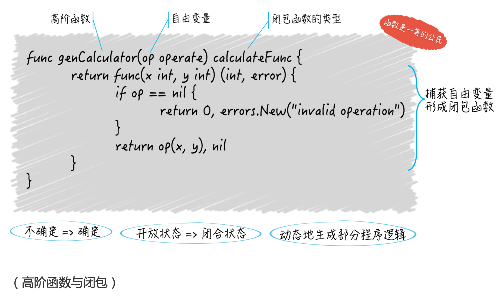

# 《Go语言核心36讲》

## 学习路线

## 模块一：Go语言基础知识

### 工作区与GOPATH
- **GOROOT**：Go语言安装根目录的路径，也就是Go语言的安装路径。
- **GOPATH**：若干工作目录的路径（可以是多个目录路径）。是我们自己定义的工作空间。
- **GOBIN**：GO程序生成的可执行文件的路径。

问题：
1. Go语言源码的组织方式是怎样的？
   - 以代码包为基本组织单元。跟java一样，多级目录就是子包。
   - 代码包一般会与源码文件所在目录同名（java好像是必须同名）。 如果不同名，在构建、安装过程中以代码包名称为准。 
   - 而其他代码在使用该包中的实体时，引用的路径为**包路径？**（还是目录路径）
  	>一个代码包的导入路径实际上就是从 src 子目录，到该包的实际存储位置的相 对路径
   - 每个包可以包含任意个.go的源码文件。
   - Go 语言源码的组织方式就是以环境变量 GOPATH、工作区、src 目录和代码包为 主线的
2. 你是否了解源码安装后的结果？（只有安装后，Go语言源码才能被我们或者其他代码使用）
3. 你是否理解构建和安装Go程序的过程？

### 命令行源码文件 VS 库源码文件


**库源码文件**是不能被直接运行的源码文件，它仅用于存放程序实体，这些**程序实体**可以被其他代码使用(只要遵从 Go 语言规范的话)。
- 程序实体是变量、常量、函数、结 构体和接口的统称。

**问题**： 怎么把命令源码文件中的代码拆分到其他库源码文件？

### 程序实体那些事儿

## 模块二：Go语言进阶技术

### 7. 数组和切片


### 8. container包中的那些容器
- **List** 实现了一个双向链表(以下简称链表)
- **Element** 则代表了链表中元素的结构。


**可以把自己生成的Element类型值传给链表吗?**


List的四个方法：
- `MoveBefore`方法和`MoveAfter`方法，它们分别用于**把给定的元素移动**到另一个元素的**前面和后面**。
- `MoveToFront`方法和`MoveToBack`方法，分别用于把给定的元素移动到链表的**最前端和最后端**。
   - “给定的元素”都是*Element类型的
   - *Element**类型**是Element类型的**指针类型**
   - *Element的**值**就是元素的**指针**。
 - `Front`和`Back`方法分别用于**获取**链表中最前端和最后端的元素。
 - `InsertBefore`和`InsertAfter`方法分别用于在**指定的元素**之前和之后插入新元素。
 - `PushFront`和`PushBack`方法则分别用于在链表的**最**前端和最后端**插入**新元素。
```go
//move
func (l *List) MoveBefore(e, mark *Element)
func (l *List) MoveToFront(e *Element)
//get
func (l *List) Front() *Element
//insert
func (l *List) InsertBefore(v interface{}, mark *Element) *Element
func (l *List) PushFront(v interface{}) *Element

```
- 函数名MoveBefore前面的`(l *List)`是啥东西？
- 这些方法都会把一个Element值的指针作为结果返回，它们就是链表留给我们的安全“接口”。


**开箱即用**
- List和Element都是结构体类型。结构体类型有一个特点，那就是它们的零值都会是拥有 特定结构，但是没有任何定制化内容的值，相当于一个空壳。值中的字段也都会被分别赋予 各自类型的零值。
  - 零值：只做声明还未初始化的变量被给予了默认值。 比如，
    - 经过语句var s []int声明的变量s的值将会是一个 []int类型的、值为nil的切片。
    - 经过语句var l list.List声明的变量l的值将会是一个长度为0的链表。这个链表持有的根元素也将会是一个空壳，其中只会包含缺省的内容
- Go 语言标准库中很多结构体类型的程序实体都做到了开箱即用。这也是在编写可供别人使用的代码包(或者说程序库)时，我们推荐遵循的最佳实践之一。
- List如何做到开箱即用？
  - 关键在于它的“延迟初始化”机制，把初始化操作延后，仅在实际需要的时候才进行。
  - 这里的链表实现中，一些方法是无需对是否初始化做判断的。比如Front方法和Back方 法，一旦发现链表的长度为0, 直接返回nil就好了。
  - 链表的PushFront方法、PushBack方法、PushBackList方法以及 PushFrontList方法总会先判断链表的状态，并在必要时进行初始化，这就是延迟初始 化。
  - List利用了自身以及Element在结构上的特点，巧妙地平衡了延迟初始化的优 缺点，使得链表可以开箱即用，并且在性能上可以达到最优。
- Element类型包含了几个包级私有的字段，分别用于存储前一个元素、后一个元素以及所 属链表的指针值。
- 另外还有一个名叫Value的公开的字段，该字段的作用就是持有元素的实 际值，它是interface{}类型的。


**问题 2:Ring与List的区别在哪儿?**
- ring实现的是一个循环列表，俗称的环。 
- 其实List在内部就是一个循环列表，只是它的根元素永远不会有任何的元素值，该元素的存在就是为了连接这个循环链表的首尾两端。
- 区别？
  - Ring类型的数据结构仅由它自身即可代表，而List类型则需要由它以及Element类型联合表示。
  - 一个Ring类型的值严格来讲，只代表了其所属的循环链表中的一个元素，而一个List类 型的值则代表了一个完整的链表。
  - 创建并初始化一个Ring值的时候，我们可以指定它包含的元素的数量，但是对于一个 List值来说却不能这样做(也没有必要这样做)，ring是固定大小的。
  - 仅通过`var r ring.Ring`语句声明的r将会是一个长度为1的循环链表，而List类型的 零值则是一个长度为0的链表。
  - Ring值的Len方法的算法复杂度是 O(N) 的，而List值的Len方法的算法复杂度则是 O(1) 的


切片这种动态扩展的特性，会出现复制很多个？啥时候回收？很浪费呀！

- 在切片被频繁“扩容”的情况下，新的底层数组会不断产生，这时内存分配的量以及元素复制的次数可能就很可观了，这肯定会对程序的性能产生负面的影响。
- 尤其是当我们没有一个合理、有效的”缩容“策略的时候，旧的底层数组无法被回收，新的底层数组中也会有大量无用的元素槽位。
- 过度的内存浪费不但会降低程序的性能，还可能会使内存溢出并导致程序崩溃。


由此可见，正确地使用切片是多么的重要。


**典型使用场景**
- list的一个典型应用场景是构造FIFO队列; 作为queue和stack的基础数据结构
- ring的一个典型应用场景是构造定长环回队列， 比如网页上的轮播;
- heap的一个典型应用场景是构造优先级队列。heap可以用来排序


### 9. 字典（map）的操作和约束
**创建**：
- 直接声明“var m map[int]string”的形式声明出来的m为nil; 
- 采用make函数创建的map不为nil，可以进行添加键值对的操作。


其实是一个哈希表的特定实现，在这个实现中，**键的类型是受限的，而元素却可以是任意类型的**。
- 如何通过键值去定位映射的value元素
  - 哈希表会先用哈希函数(hash function)把键值转换为哈希值。**哈希值通常是一个无符号的整数**。
  - 一个哈希表会持有一定数量的桶(bucket)，我们也可以叫它哈希桶，这些哈希 桶会均匀地储存其所属哈希表收纳的键 - 元素对。
  - 哈希表会先用这个键哈希值的低几位去定位到一个哈希桶，然后再去这个哈希桶中，查找这个键。
  - 由于键 - 元素对总是被捆绑在一起存储的，所以一旦找到了键，就一定能找到对应的元素 值。


字典不会单独存储键的值，只会存储键的哈希值，而查找的时候如果哈希值匹配上，还需要去比较键值，防止哈希碰撞。这里的键值是放在哪里？如何拿到的？
>哈希桶里的结构是，“键的哈希值-内部结构”对的集合，这个内部结构的结构是“键1 元素1 键2 元素2 键3 元素3”，是一块连续的内存。在通过键的哈希值定位找到哈希桶和那 个“键的哈希值-内部结构”对之后，就开始在这个内部结构里找有没有这个键。

**字典的键类型不能是哪些类型?**
>Go 语言 字典的**键**类型**不**可以是**函数类型、字典类型和切片类型**。
- 键类型的值**必须要支持判等**操作。而函数类型、字典类型和切片类型的值并不支持判等操作
  - 因为要去根据哈希值寻找值在哪个桶去判断等，如果哈希值相等，还需要判断值是否相等，这里就要求值必须可以比较相等了。因为会存在哈希碰撞。
- 如果键的类型是接口类型的，那么键值的实际类型也不能是上述三种类型
```go
//变量badMap2的类型是键类型为interface{}、值类型为int的字典类型。这样声明并不会引起什么错误。
或者说，我通过这样的声明躲过了 Go 语言编译器的检查
var badMap2 = map[interface{}]int{
   "1": 1,
   []]int{2}: 2, // 这里会引发 panic。
    3: 3, 
    }
```
- 当我们运行这段代码的时候，Go 语言的运行时(runtime)系统就会发现这里的问 题，它会抛出一个 panic。
- 我们越晚发现问题，修正问题的成本就会越高，所以**最好不要把字典的键类型设定为任何接口类型**。
- 如果键的类型是数组类型，那么还要确保该类型的元素类型不是函数类型、字典
类型或切片类型。


**应该优先考虑哪些类型作为字典的键类型？**
- 从性能考虑：**求哈希和判等操作的速度越快**，对应的类型就**越适合**作为键类型
  - 以求哈希的操作为例，宽**度越小**的类型**速度通常越快**。
    - 类型的**宽度**是指它的单个值需要占用的字节数。bool、int8和uint8类型的一个值 需要占用的字节数都是1
    - 对于布尔类型、整数类型、浮点数类型、复数类型和指针类型来说都是如此。
    - 对于字符串类型，由于它的宽度是不定的，所以要看它的值的具体长度，长度越短求哈 希越快。
    - 对数组类型的值求哈希实际上是依次求得它的每个元素的哈希值并进行合并，所以速度就取决于它的元素类型以及它的长度。 修改数组的值就是不一样的hash值了，所以不推荐使用
    - 对结构体类型的值求哈希实际上就是对它的所有字段值求哈希并进行合并，所以关键在于它的各个字段的类型以及字段的数量。可以控制其中各字段的访问权限的话，就可以阻止外界修改它了
    - 而对于接口类型，具体的哈希算法，则由值的实际类型决定。把接口类型作为字典的键类型**最危险**。
  - 优先选用数值类型和指针类型，通常情况下类型的宽度越小越好。如果非要选择字符串类型的话，最好对键值的长度进行额外的约束。


**在值为nil的字典上执行读操作会成功吗，那写操作呢?**
- 在一个值为nil的字典上，添加键-元素会引起运行时抛出一个panic，其他任何操作都不会引起错误。
  - 既然无法添加键值对，那是不是就无用？ **可以对m直接用索引表达式添加**


其他：
- map不是并发安全的， 判断一个操作 是否是原子的可以使用 `go run race` 命令做数据的竞争检测

### 10. 通道的基本操作
>Don’t communicate by sharing memory; share memory by communicating. (不要通过共享内存来通信，而应该通过通信来共享内存。)  ---Go 语言的主要创造者之一的 Rob Pike 的至理名言

通道类型是后半句话的完美实现，我们可以利用通道在多个 goroutine 之间传递数据。


**基础知识**：
- **通道类型的值**本身就是**并发安全**的，这也是 Go 语言自带的、唯一一个可以满足并发安全性 的类型。
- 用内建函数make声明一个通道类型变量，第一个参数用代表**通道具体类型**的类型字面量。 同时要确认该通道的**元素类型**，决定这个通道传递声明类型数据。
  - `chan int`，其中chan表示通道类型的关键字， int是该通道的元素类型。
  - make函数除了必须接收这样的类型字面量作为参数，还可以接收一个可选的int类型的参数作为容量。
  - 当容量为0时，我们可以称通道为非缓冲通道，反之就是缓存通道。
- 一个通道相当于一个**先进先出**(FIFO)的队列。
  - 也就是说，通道中的各个元素值都是严格地**按照发送的顺序排列**的，先被发送通道的元素值一定会先被接收。
- 元素值的发送和接收都需要用到**操作符<-**。
  - 我们也可以叫它**接送操作符**。一个左尖括号紧接着一个减号形象地代表了元素值的传输方向。
- 从通道接收元素值的时候，同样要用接送操作符<-，只不过，这时需要把它写 在变量名的左边，用于表达“要从该通道接收一个元素值”的语义。
  - 比如`<-ch1`，这也可以被叫做**接收表达式**。
  - 如果我们需要把如此得来的元素值存起来，那么在接收表达式的左边就需要依次添加赋值符 号(=或:=)和用于存值的变量的名字。
```go
func main() {
        ch1 := make(chan int, 3)
        ch1 <- 2
        ch1 <- 1
        ch1 <- 3
        //将最先进入ch1 的元素2接收来并存入变量elem1
        elem1 := <-ch1
        fmt.Printf("The first element received from channel ch1: %v\n",elem1)
```


**对通道的发送和接收操作都有哪些基本特性？**
- 对于同一个通道，发送操作之间和接收操作之间是互斥的。 
  - 发送和接收操作之间呢？
  - 对于通道中的**同一个元素值**来说，**发送操作和接收操作之间也是互斥的**。
- 发送操作和接收操作对元素值的处理是原子性的不可分割。
  - 元素值从外界进入通道时会被复制，也就是进入通道的是其副本。
  - 移动操作分两步： 先生存通道值这个元素值的副本，准备给到接收方，接着删除通道中这个元素值。
  - 接收操作在准备好元素值的副本之后，一定会删除掉通道中的原值，绝不会出现通道中仍有残留的情况。
- 发送操作完成之前会被阻塞，接收操作也是如此。
  - 接收操作通常包含了“复制通道内的元素值”“放置副本到接收方”“删掉原值”三个步骤。
  - 在所有这些步骤完全完成之前，发起该操作的代码也会一直阻塞，直到该代码所在的 goroutine 收到了运行时系统的通知并重新获得运行机会为止。
  - 如此阻塞代码其实就是为了实现操作的互斥和元素值的完 整。
- 长度代表通道当前包含的元素个数，容量就是初始化时你设置的那个数。
- 通道底层存储数据的是环形链表。


**发送操作和接收操作在什么时候可能被长时间的阻塞?**
- 缓存通道： 
  - 满了-》所有发送操作会被阻塞，知道元素被接收走，会优先通知最早等待、那个发送操作所在的goroutine。
  - 空了-》接收操作被阻塞。。。
- 非缓存通道：无论是发送操作还是接收操作，一开始执行就会被阻 塞，直到配对的操作也开始执行，才会继续传递。 
  - 就是**同步**的方式传递数据。
  - 数据是直接从发送方复制到接收方的，中间并不会用非缓冲通道做中转。**那还会有删除通道中的元素这个操作嘛？**
- 一定不要忘记初始化通道。（用make函数去做初始化）
  - 对于值为nil的通道，无论它具体是什么类型，对它的发送操作和接收操作都会永久地处于阻塞状态。
  - 通道是引用类型。


**发送操作和接收操作在什么时候会引发 panic?**
- 对已关闭的通道进行发送操作，会应发panic
- 试图关闭一个已经关闭的通道。

接收操作是可以感知到通道的关闭的，并能够安全退出。
- 接收表达式的结果会有两个变量，第二个变量类型是bool，为false表示通道已经关闭，并且没有元素可以取了。 
- 如果还有元素可以取，但是通道关闭了，那么接收表达式的第一个结果，仍会是 通道中的某一个元素值，而第二个结果值一定会是true。（这个接收操作是在关闭后做的还是？是在关闭后，**通道关闭后还是可以进行接收操作**？直到其没有元素）
  - 因此，通过接收表达式的第二个结果值，来判断通道是否关闭是可能有延时的。
  - 所以，**千万不要让接收方关闭通道，而是让发送发做这件事。**


### 11. 通道的高级用法
**单项通道**： 只能接收或者只能发送的通道
- 定义（**从操作chan的代码的角度**）：
  - chan<- int 只能发送不能接收。（只能把数据发给chan）
  - <-chan int 只能接收不能发送。
```go
var uselessChan = make(chan<- int, 1)
```


**单项通道有什么应用价值？**
最主要的用途就是约束其他代码的行为。
>一个类型如果想成为一个接口类型的实现类型，那么就必须实现这个接口中定义的所有方法。
- 因此，如果我们在某个方法的定义中使用了单向通道类型，那么就相当于在对它的所有实现做出约束。
- 在**函数声明的结果列表中使用单向通道**: 函数getIntChan会返回一个<-chan int类型的通道，这就意味着得到该通道的程序， 只能从通道中接收元素值。这实际上就是对函数调用方的一种约束了。
```go
func getIntChan() <-chan int {
   num := 5
   ch := make(chan int, num)
   for i := 0; i < num; i++ {
      ch <- i
   }
   close(ch)
   return ch
}
```
- 在 Go 语言中还可以声明函数类型，如果我们在函数类型中使用了单向通道，那 么就相等于在约束所有实现了这个函数类型的函数.


顺便看一下调用getIntChan的代码: 
```go
intChan2 := getIntChan()
for elm := range intChan2 {
   fmt.Printf("The element in intChan2: %v\n", elem)
}
```
把调用getIntChan得到的结果值赋给了变量intChan2，然后用for语句循环地取出了 该通道中的所有元素值，并打印出来。

带有range子句的for语句的用法说明：
- 一、这样一条for语句会不断地尝试从intChan2种取出元素值，即使intChan2被关 闭，它也会在取出所有剩余的元素值之后再结束执行。
- 二、当intChan2中没有元素值时，它会被阻塞在有for关键字的那一行，直到有新的元 素值可取。
- 三、假设intChan2的值为nil，那么它会被永远阻塞在有for关键字的那一行。
>这就是带range子句的for语句与通道的联用方式。 Go 语言还有一种专门为了操作 通道而存在的语句:select语句。


**select语句与通道怎样联用，应该注意些什么？**
- select语句只能与通道联用，它一般由若干个分支组成。每次只有一个分支中的代码会被运行。
- 分支分为2种：
  - 候选分支： 总是以 case 开头，后跟一个case表达式和一个冒号，再下一行写需要执行的语句。 类似switch的case
  - 默认分支： default case， 同上。
- 每个case表达式只能包含操作通道的表达式，比如接收表达式。 
  >如果我们需要把接收表达式的结果赋给变量的话，还可以把这里写成**赋值语句或者短变量声明。**
```go
func example1() {
	// 准备好几个通道。
	intChannels := [3]chan int{
		make(chan int, 1),
		make(chan int, 1),
		make(chan int, 1),
	}
	// 随机选择一个通道，并向它发送元素值。
	index := rand.Intn(3)
	fmt.Printf("The index: %d\n", index)
	intChannels[index] <- index
	// 哪一个通道中有可取的元素值，哪个对应的分支就会被执行。
	select {
	case <-intChannels[0]:
		fmt.Println("The first candidate case is selected.")
	case <-intChannels[1]:
		fmt.Println("The second candidate case is selected.")
	case elem := <-intChannels[2]:
		fmt.Printf("The third candidate case is selected, the element is %d.\n", elem)
	default:
		fmt.Println("No candidate case is selected!")
	}
}
```


### 12. 使用函数的正确姿势
下面这段代码中的`printToStd`函数不需要定义两个返回值的嘛？确实没有报错。
```go
package main

import "fmt"

type Printer func(contents string) (n int, err error)

func printToStd(contents string) (bytesNum int, err error) {
	return fmt.Println(contents)
}

func main() {
	var p Printer
	p = printToStd
	p("something")
}
```


**如何编写高阶函数？**


“把函数传给函数”以及“让函 数返回函数”来编写高阶函数。
>既不要把你程序的细节暴露给外界，也尽量不要让外界的变动影响到你的程序。
```go
type operate func(x, y int) int

func calculate(x int, y int, op operate) (int, error) { 
  if op == nil {
      return 0, errors.New("invalid operation")
  }
  return op(x, y), nil 6
}

func main(){

}
```
- 把函数作为一个普通的值赋给一个变量。
- 实现一个签名与operate类型的签名一致的函数即可。


**如何实现闭包？** 
- 在一个函数中存在对外来标识符的引用
  - **外来标识符**：也叫自由变量， 既不代表当前函数的任何参数或结果，也不是函数内部声明的，而是直接从外边拿过来的。
- 闭包体现的是由”不确定“变为”确定“的一个过程。
- 我们常说的 **闭包函数**： 就是引用了自由变量，而呈现出一种“不确定”的状态，也叫“开放状态”
  - 它的**内部逻辑并不是完整**的，有一部分逻辑需要这个自由变量参与完成，在闭包函数被定义的时候自由变量到底代表了什么是未知的。（只知道类型）
- 示例：
  - genCalculator函数只做了一件事：定义一个**匿名的**、calculateFunc**类型**的**函数并把它作为结果值**返回
    - 这个匿名的函数就是一**个闭包函数**。
    - 它里面使用的变量op既不代表**它**的任何参数或结果 也不是它自己声明的，而是定义它的genCalculator函数的参数，所以是一个自由变量
      - 这个自由变量究竟代表了什么？不是在这个闭包函数定义的时候确定的，而是在genCalculator函数被调用的时候确定的————会把op作为其参数传进来，只有给定了该函数的参数op，我们才能知道它返回给我们的闭包函数可以用于什么运算。）
      - 当运行到`if op == nil`·时，编译器会试图寻找op所代表的东西，发现op代表genCalculator函数的参数，这个时候该自由变量被捕获了，也就是确定它是啥了。如此一来，这个闭包函数的状态就 由“不确定”变为了“确定”，或者说转到了“闭合”状态，至此也就真正地形成了一个闭包。
```go

func genCalculator(op operate) calculateFunc {
  return func(x int, y int) (int, error) {
    if op == nil {
      return 0, errors.New("invalid operation")
    }
    return op(x, y), nil
  }
}
```

用高阶函数实现闭包。



**实现闭包的意义是啥？**
- 表面上看，就是延迟实现了一部分程序逻辑或功能而已。
- 实际上，是在 **动态地生成**那部分逻辑。
  - 可以根据生成功能不同的函数，从而影响后续的程序行为，**类似模板方法**。  


**函数的传参**


- 传值的拷贝
  - 数组是值类型，其拷贝就是值，内部对其修改，不会影响外面的数组
  - 对于引用类型，拷贝是浅拷贝，只是拷贝指向其本身（也就是引用、指针），而不是其背后的值。 所以对引用、指针做了修改，也就是会改动地址背后的值了。
  - 如果拷贝的是值类型的参数值，**但这个参数值中某个元素是引用类型**？ 比如一个数组里面存的是切片，那这个数组作为参数被修改，对外面会有影响嘛？
```go
complexArray ：= [3][]string{
  []string{"a", "b", "c"},
  []string{"d", "be", "g"},
  []string{"f", "g", "r"},
}
```
- 如果修改的是数组，比如把 `arr[0] = []string{"ww", "gg", "cc"} `，那不会影响外面； 如果修改的是这个数组的值也就是里面的切面，那就会影响。


**返回值是否也会进行拷贝？**
- 当函数**返回指针类型时不会发生拷贝**。
- 当函数返回非指针类型并把结果赋值给其它变量肯定会发生拷贝。 那如果不进行赋值，就是调用下？


**函数和方法的区别？**
- 函数是独立的程序实体。 声明时可以有名/无名，可以当做普通的值传来传去。
- 我们能把具有相同签名的函数抽象成独立的函数类型，以作为一组输入、输出(或者说一类逻辑组件)的代表。
- 方法： **需要有名字**， 不能当做值来开年代，**比如隶属于某一个类型**（通过声明中的接收者声明体现）。
  - 接收者声明必须包含确切的名称和类型字面量（类型T或者其指针 *T，后者需要改变其状态时使用）
    - 接收者的类型其实就是当前方法所属的类型，
    - 而接收者的名称，则用于在当前方法中引用它所属的类型的当前值。
  - 通过方法add的接收者p，我们可以在其中引用到当前值的任何一个字段，或者调用到当前值的任何一个方法(也包括add方法自己)
  - 方法隶属的类型其实并不局限于结构体类型，但必须是某个自定义的数据类型，并且**不能是任何接口类型**。


有一种说法：方法的定义感觉本质上也是一种语法糖形式，其本质就是一个函数，**声明中的方法接收者就是函数的第一个入参**，在调用时go会把施调变量作为函数的第一个入参的实参传入。

### 13. 结构体及其方法使用法门

**内嵌其他结构体**

- 如果一个字段的声明中只有字段的类型名而没有字段的名称，那么它就是一个嵌入字段，也可以被称为匿名字段。
- 我们可以通过此类型变量的名称后 跟“.”，再后跟嵌入字段类型的方式引用到该字段。其实默认生成了一个字段名，就是类型名。 
- 但是也可以直接用大的结构体名，直接.操作符 获取子匿名结构体字段
>注意，只要名称相同，无论这两个方法的签名是否一致，被嵌入类型的方法都会“屏蔽”掉嵌入字段的同名方法。 比如string方法。 字段同名也会被覆盖？是否无视类型是否相同？


**值方法和指针方法的区别**
- 方法的接收者类型必须是某个自定义的数据类型，而且不能是接口类型或接口的指针类型。
- 所谓的值方法，就是接收者类型是非指针的自定义数据类型的方法。值方法的接收者是该方法所属的那个类型值的一个副本。对齐修改一般不会影响原值（除非原值就是指针类型）
- 指针方法接收者是那个基本类型的指针值的副本。

### 14. 接口类型的合理利用
```go
type Fly interface{

}
```

* 接口类型与其他数据类型不同，它是**没法被实例化**。
  * 既不能通过调用new函数或make函数创建出一个接口类型的值，也无法 用字面量来表示一个接口类型的值
- 接口类型的类型字面量与结构体类型的看起来有些相似，它们都用花括号包裹一些核心信息。
  - 只不过，**结构体类型包裹的是它的字段声明**，而**接口类型包裹的是它的方法定义**。
  - 一个接口的方法集合就是它的全部特征。
  - 对于任何数据类型，只要它的方法集合中完全包含了一个接口的全部特征(即全部的方法)，那么它就一定是这个接口的实现类型。


**怎样判定一个数据类型的某一个方法实现的就是某个接口类型中的某个方法呢?**
- 方法签名一致， 方法名称也要一致。


```go
dog := Dog{"little pig"}
var pet Pet = &dog
```
**针对接口类型的几个名词**
- **动态值**： 就是把dog的实例赋给了 pet
- **动态类型**： 这个值的实际类型就叫动态类型。
- **静态类型**： pet 的静态类型是Pet，并且永远是Pet，动态值可以值dog或者cat等


如果我们使用一个变量给另外一个变量赋值，那么真正赋给后者的，并不是前者持有的那个值，而是该值的一个副本。
```go
dog := Dog{"little pig"}
var pet Pet = dog
dog.SetName("monster")
```
>接口变量的值并不等同于这个可被称为动态值的副本。它会包含两个指针，一个指针指向动态值，一个指针指向类型信息. 基于此，扩展下面一个知识点。


**知识点**
```
var dog1 *Dog   //dog1 is nil
dog2 := dog1   //dog2 is nil
var pet Pet = dog2   //pet is not nil
```
- 只要我们把一个有类型的nil赋给接口变量，那么这个变量的值就一定不会是那个真正的 nil。
- 因此，上面代码当我们使用判等符号==判断pet是否与字面量nil相等的时候，答案一定会是 false。
  - 在 Go 语言中，我们把由字面量nil表示的值叫做无类型的 nil。这是真正的nil，因为它的类型也是nil的。
  - 虽然dog2的值是真正的nil，但是当我们把这个变量赋给pet的时候，Go 语言会把它的类型和值放在一起考虑。这时 Go 语言会识别出赋予pet的值是一个*Dog类型的nil。然后，Go 语言就会用一个iface的实例包装它，包装后的产物肯定就不是nil了。
- 怎样才能让一个接口变量的值真正为nil呢?
  - 要么只声明它但不做初始化，
  - 要么直接 把字面量nil赋给它。


**接口之间组合**
- 通过嵌入，而且不像结构体嵌入会出现同名字段方法的屏蔽， **接口出现同名方法无法通过编译**，哪怕方法签名不同也不行。
- Go 语言团队鼓励我们声明体量较小的接口，并建议我们通过这种接口间的组合来扩展程 序、增加程序的灵活性。
- 

### 15. 关于指针的有限操作
- 指针是一个指向某个确切的内存地址的值。
- **uintptr**类型： 实际上是一个数值类型，也是 Go 语言内建的数据类型之一。
  - 它可以存储 32 位或 64 位的无符号整数，可以代表任 何指针的位(bit)模式，也就是原始的内存地址。
- unsafe包中有一个类型叫做**Pointer**，也代表 了“指针”。
  - unsafe.Pointer可以表示任何指向**可寻址**的值的指针，同时它也是前面提到的指针值和 uintptr值之间的桥梁。


**Go 语言中的哪些值是不可寻址？**
- **不可变的**：
  - 常量
  - 基本类型值的字面量
  - 字符串值也是不可变的，所以字符串的索引和切片也是不可寻址的。
  - 函数以及方法的字面量。（也考虑到安全性）
- **临时结果**：
  - 算术操作的结果值。 这些结果值赋给任何变量或者常量之前是临时的，之后就可以寻址了。
  - 可以把各种对**值字面量**施加的**表达式的求值结果**都看做是临时结果：
    - 获取某个元素的索引表达式
      - 数组字面量和字典字面量的索引结果值
      - 数组字面量和切片字面量的切片结果值
    - 获取某个切片的切片表达式（不是索引表达式）
      - **例外**：切片的索引表达式，也就是切片字面量的索引结果值是可寻址的。每个切片值都会持有一个底层数组，而这个底层数组中的每个元素值都有一个确切的内存地址。
      - 而切片的切片表达式是不可寻址的，因为切片表达式总会返回一个新的切片值，而这个新的切片值在被赋予给变量之前属于临时结果。赋值之后就是可以寻址的了。
    >**注意**：上面在说针对数组值、切片值或字典值的字面量的表达式会产生临时结果。如果针对的是数组类型或切片类型的变量，那么索引或切片的结果值就都不属于临时结果了，是可寻址的。 因为**变量的值本身就不是临时的**。

    - 访问某个字段的选择表示
    - 调用某个函数或方法的调用表达式
    - 转换值的类型的类型转换表达式
    - 判断值的类型的类型判断表达式
    - 向通道发送元素值或者从通道接收元素值的接收表达式
- **不安全的**：
  - 不安全的”操作很可能会破坏程序的一致性，引发不可预知的错误，从而严重影响程序的功能和稳定性。
    - 对字典类型的变量施加索引表达式，得到的结果值不属于临时结果，可是，这样的值却是不可寻址的。原因是，字典中的每个键 - 元素对的存储位置都可能会变化，而且这种变化外界是无法感知的。不安全。
    - 获取由字面 量或标识符代表的函数或方法的地址显然也是不安全的。


**不可寻址的值在使用上有哪些限制?**
- 无法使用取址操作符&获取它们的指针。 会编译报错。
  


引入个问题，下面程序如果直接调用New函数**初始化Dog类型的值**，然后 **直接以链式手法**调用其结果值的**指针方法**SetName，是否能达到预期效果？
```go
func New(name string) Dog {
  return Dog{name}
}
```
- 调用New函数所得到的结果值属于临时结果，是不可寻址的。
- 但是在一个基本类型的值上调用它的指针方法，这是因为 Go 语言会自动地帮我们转译。
>`dog.SetName("monster") `会被自动地转译为`(&dog).SetName("monster")`，即:先取dog的指针值，再在该指针 值上调用SetName方法。
- 对不可寻址的结果值做取址操作，会报错。 但是如果调用的是非指针方法，就没问题。


Go 语言中的++和--并不属于操作符，而分别是自增语句和自减 语句的重要组成部分。
- 只要在++或--的左边添加一个表达式，就可以组成一 个自增语句或自减语句。
- 这个表达式的结果值必须是可寻址的。 这导致 **值字面量**的表达式都无法使用自增、自减语句。
- **例外**： 字典字面量和字典变量索引表达式的结果值都是不可寻址的。
  - 可以被用在自增自减语句中。
  - 还能被用在赋值语句的赋值操作符左边的表达式里（这个结果值也必须是可寻址的）
  - 还有，range关键字左边的表达式的结果值也都必须是可寻址的

### 16. go语句
>Don’t communicate by sharing memory; share memory by communicating.

goroutine 代表着并发编程模型中的用户级线程。


- Go语言不仅有独特的并发编程模型以及用户级线程goroutine，还拥有强大的用于调度goroutine、对接系统级线程的调度器。
- 调度器负责统筹调配Go并发编程模型中的三个主要元素：G（gogroutine）、P（processor 对接G和M）、M(machine 系统级线程)


**什么是主gogroutine？它与我们启动的其他goroutine有什么区别？**

看个题目：下面代码会打印出什么？   会是“打印出 10 个10”嘛? **啥都不打印**
>由于go func后，主代码会继续往下，也就是下个迭代，但快速迭代完10次之后，第一个进入栈的go func也许都还没打印，主流程就结束退出了。当然，也可能在主流程结束前，go func有被运行的，但是不保证顺序，不保证有多少.

**注意：** i的值为啥会变化？不是值的副本嘛？ 
>如果go函数是无参数的匿名函数，那么在它里面的 fmt.Println函数的参数只会在go函数被执行的时候才会求值。到那个时候，i的值可能已经是 10(最后一个数)了，因为for语句那时候可能已经都执行完毕了。
```go
package main

import "fmt"

func main(){
  for i := 0; i < 10; i++ {
    go func(){
      fmt.Println(i)
    }()
  }
}
```
- go函数的执行时间总是会明显滞后于它所属的go语句的执行时间（做一些上下文准备）。
  >**准备**：在拿到了一个空闲的 G 之后，Go 语言运行时系统会用这个 G 去包装当前的那个go函数 (或者说该函数中的那些代码)，然后再把这个 G 追加到某个存放可运行的 G 的队列中
- 因为只要go语句本身执行完毕， Go 程序完全不会等待go函数的执行，它会立刻去执行后边的语句。
- 一旦主 goroutine 中的代码(也就是main函数中的那些代码)执行完毕，当前的 Go 程序就会结束运行。


**用什么手段可以对 goroutine 的启用数量加以限制?**
- goroutine pool 
- buffered channel
- WaitGroup


**怎样才能让主 goroutine 等待其他 goroutine?**
- 使用通道，让子go干完活后通知主go。
```go
func main() {
	num := 10
	sign := make(chan struct{}, num)

	for i := 0; i < num; i++ {
		go func() {
			fmt.Println(i)
			sign <- struct{}{}
		}()
	}

	// 办法1。
	//time.Sleep(time.Millisecond * 500)

	// 办法2。
	for j := 0; j < num; j++ {
		<-sign
	}

  //方法3 sync.WaitGroup 后面再讲
}
```
- 为啥用struct{}类型的通道？ 因为空结构体（struct{}类型 值的表示法只有一个 struct{}{}）其内存占用为0字节（这个值整个go程序永远只会存在一份）。


**怎么让启动的多个gogroutine按照既定顺序运行？**
可以自己思考下怎么设计，用一个count参数去匹配每次进来的i，如果子go带着i进来发现不等于count（从0开始安全的累加），就会自旋判断。 等于就打印，然后count++,其他自旋的共享一个count会不断满足，然后依次输出。
- 注意count的安全累加，毕竟会竞争。


**runtime包中提供了哪些与模型三要素 G、P 和 M 相关的函数?**
- runtime.GOMAXPROCS 这个应该能控制P的数量


### 17. if语句、for语句、switch语句

**for range时的注意事项**

- range 一个数组或者切片的时候，会得到两个值，第一个是索引值i，第二个值是是存的值v，如果只接收一个默认是索引值。
- 切片与数组是不同的，前者是引用类型的，而后者是值类型的。而又因为 
  - range表达式只会在for语句开始执行时被求值一次，无论后边会有多少次迭代。 什么意思？看下面代码
  - range表达式的求值结果会被复制，也就是说，被迭代的对象是range表达式结果值的
副本而不是原值。
```go
  numbers2 := [...]int{1, 2, 3, 4, 5, 6}
	maxIndex2 := len(numbers2) - 1
	for i, e := range numbers2 {
		if i == maxIndex2 {
			numbers2[0] += e
		} else {
      //每次都会把相邻的两个值相加赋值给后面的数。
			numbers2[i+1] += e
		}
	}
	fmt.Println(numbers2)
```
打印出： 7 3 5 7 9 11
- 第一次循环后num[1]等于1+2=3没问题
- 按道理第二次循环 i=1, num[2] = num[2] + e(也就是n[1]) 应该等于3+3=6,实际却是5,那是因为 每次的e在最开始已经确定了，也就是说n[1]是固定的2， 所以这里是 3 + 2 = 5
>被迭代的对象的第二个元素却没有任何改变，毕竟它与numbers2已经是毫不相关的 两个数组了。


改成切片就可以不断更新值了。因为切片是引用类型。


**switch语句中的switch表达式和case表达式之间有着怎样的联系?**
- case表达式的类型要跟switch的相同，不相同编译报错。
  - 如果case表达式中子表达式的结果值是无类型的常量，那么它的类型会被自动地转换为switch表达式的结果类型。 转换失败也无法通过编译。
  - 如果这些表达式的结果类型有某个接口类型，那么一定要小心检查它们的动态值是否 都具有可比性。 如果没有会抛异常。
- 所有case表达式的子表达式的结果值不能重复。（只对于由字面量直接表示的子表达式而言，如果是索引值等间接的不要求，除了switch是判断类型的，比如 `switch x.(type)`）


**在if语句中，初始化子句声明的变量的作用域是什么?**
if后面的表达式以及大括号内的区域都是。


### 18. 错误处理

- 在生成error类型值的时候用到了errors.New函数。 这是一种**最基本**的生成错误值的方式。
- 我们调用它的时候**传入一个由字符串**代表的错误信息，它会给**返回**给我们一个**包含了这个错误信息的error类型值**。
  - 该值的静态类型当然是 error，
  - 而动态类型则是一个在errors包中的，包级私有的类型*errorString。
- 实际上，error类型值的 Error方法就相当于其他类型值的String方法。
- fmt.Printf函数如果发现被打印的值是一个error类型的值，那么就会去调用它的Error方法。fmt包中的这类打印函数其实都是这么做的。
- 当我们想通过模板化的方式生成错误信息，并得到错误值时，可以使用 `fmt.Errorf`函数。
  - 该函数会先调用fmt.Sprintf函数，得到确切的错误信息;再调用errors.New函数，得到包含该错误信息的error类型值。


**怎样判断一个错误值具体代表的是哪一类错误?**
>error是一个接口类型，所以即使同为error类型的错误值，它们的实际类型也可能不同。

1. 对于类型在已知范围内的**一系列**错误值，一般使用**类型断言表达式**或类型switch语句来判断;
>只要类型不同，我们就可以如此分辨
```go
//获取和返回已知的操作系统相关错误的潜在错误值
func underlyingError(err error) error {
  switch err := err.(type) {
    case *os.PathError:
      return err.Err
    case *os.LinkError:...
    case *os.SynscallError:
    case *exec.Error:
  }
  return err
}
```
2. 对于**已有相应变量**且**类型相同**的一系列错误值，一般直接使用**判等**操作来判断;
```go
switch err {
  case os.ErrClosed:
        fmt.Printf("error(closed)[%d]: %s\n", i, err)
  case os.ErrInvalid:
        fmt.Printf("error(invalid)[%d]: %s\n", i, err)
  case os.ErrPermission:
        fmt.Printf("error(permission)[%d]: %s\n", i, err)
}

```  
3. 对于**没有**相应变量且类型未知的一系列错误值，只能**使用其错误信息的字符串**表示形式
来做判断。


**怎样根据实际情况给予恰当的错误值。**


- 构建错误值体系的基本方式有两种，即:
  - 创建立体的错误类型体系
  - 创建扁平的错误值列表。


**错误体系**
- error (Error())
  - net.Error (..,Timeout(), Temporary)
    - *net.OpError
    - *net.AddrError
    - net.UnkonwNetworkError
>当net包的使用者拿到一个错误值的时候，可以先判断它是否是net.Error类型的，也就是说该值是否代表了一个网络相关的错误。
>os包中的一些错误类型类似，它们也都有一个名为Err、类型为error接口类型的字段，代表的也是当前错误的潜在错误。

- 如果你不想让包外代码改动你返回的错误值的话，一定要小写其中字段的名称首字母。
- 你可以通过暴露某些方法让包外代码有进一步获取错误信息的权限，比如编写一个 可以返回包级私有的err字段值的公开方法Err。
- 由于error是接口类型，所以通过errors.New函数生成的错误值只能被赋给变量，而**不能赋给常量**，又由于这些代表错误的变量需要给包外代码使用，所以其**访问权限只能是公开的**。


### 19. panic函数、recover函数以及defer语句

**怎么让 panic 包含一个值，以及应该让它包含什么样的值？**
- 将值作为参数传给该函数就可以，panic函数的唯一一个参数是**空接口**(也就是interface{})类型的，所以从语法上讲， 它可以**接受任何类型的值。**
  - 最好传入error类型的错误值，或者其他的可以被有效序列化的值。
    - 有效序列化： 如果你觉得某个值有可能会被记到日志里，那么就应该为它关联String方法。如果 这个值是error类型的，那么让它的Error方法返回你为它定制的字符串表示形式就可以 了。


**怎样施加应对 panic 的保护措施，从而避免程序崩溃?**
- recover函数无需任何参数，并且会返回一个空接口类型的值。
- 这个值实际上就是即将恢复的 panic 包含的值。并且，如果这个 panic 是因我们调用panic函数而引发的，那么该值同时也会是我们此次调用panic函数时，传入的参数值副本。


**用法不正确的情况**
- 在panic之后才定义recover()，运行不到。
- 在同级panic之前定义也运行不到，因为会立即返回上一层。而且上一层也会立即返回上上一层。
- 需要在defer后面放recover，因为defer是无论什么情况结束的程序，之后都会执行defer后面的函数（注意是后面的函数，不是表达式）
  - **注意**：被延迟执行的是defer函数，而不是defer语句
- 多条defer，按照入栈顺序，后入先出。


## 模块三：Go语言实战应用

### 23. 测试的基本规则和流程
>用测试找出自己的缺点，人是否会进步以及进步得有多快，依赖的恰恰就是对自我的否定，这包 括否定的深刻与否，以及否定自我的频率如何。这其实就是“不破不立”这个词表达的含 义。


**分类**：都算单元测试
- 功能测试: 用于测试程序的一些逻辑行为是否正确.
- 基准测试: 以Benchmark为函数名前缀的函数，它们用于衡量一些函数的性能.会多次运行基准测试函数以计算一个平均的执行时间
- 示例测试: 以Example为函数名前缀的函数，提供一个由编译器保证正确性的示例文档。

>一个测试源码文件**只会针对于某个命令源码文件**，或库源码文件(以下简称被测源码文件)做测试，所以我们总会(并且应该)把它们**放在同一个代码包内**.

go test命令会遍历所有的*_test.go文件中符合上述命名规则的函数，生成一个临时的main包用于调用相应的测试函数，接着构建并运行、报告测试结果，最后清理测试中生成的临时文件。


**命名**
- 测试文件：应该以被测源码文件的主名称为前导，并且必须以“_test”为后缀。
- 测试函数：
  - 对于功能测试函数来说，其名称必须以**Test**为前缀，并且参数列表中只应有一个 `*testing.T`类型的参数声明。
  - 对于性能测试函数来说，其名称必须以**Benchmark**为前缀，并且唯一参数的类型必须是 `*testing.B`类型的。
  - 对于示例测试函数来说，其名称必须以**Example**为前缀，但对函数的参数列表**没有强制规定**。


go test命令执行的主要测试流程是什么?
- 准备工作： 确定内部需要用到的命令，检 查我们指定的代码包或源码文件的有效性，以及判断我们给予的标记是否合法。
- 然后针对每个测试包**依次**进行（串行这些动作）：
  - 构建
  - 执行包中符合要求的测试函数
  - 清理临时文件
  - 打印测试结果
>但是，为了加快测试速度，它通常会**并发地对多个被测代码包**进行功能测. 只不过在最后打印测试结果时候，它会按照给定的顺序逐个进行，虽然才会让我们感知到是串行。


**性能测试特殊之处**
- 由于并发的测试会让**性能测试**的结果存在偏差，所以性能测试一般都是串行进行 的。更具体地说，只有在所有构建步骤都做完之后，go test命令才会真正地开始进行性 能测试。
- 下一个代码包性能测试的进行，总会等到上一个代码包性能测试的结果打印完成才会开始，而且性能测试函数的执行也都会是串行的。
  >这也就解释了为啥简单性能测试也比很多功能测试慢。


>多次执行一样的测试，可能会使用缓存，直接返回测试结果。 go clean -cache 手动清理缓存。运行go clean -testcache将会删除所有 的测试结果缓存。设置值为gocacheverify=1将会导致 go 命令绕过任何的缓存数据。


- 当我们在其中调用t.Fail方法时，虽然当前的测试函数会继续执行 下去，但是结果会显示该测试失败.
- 对于失败测试的结果，go test命令并不会进行缓存


**更多测试手法**


>涉及testing包中更多的 API、go test命令支持的，更多标记更加复杂的测试结果，以及测试覆盖度分析。


- `-cpu`标记正是用于设置P的最大个数的。最大 P 数量就代表着 Go 语言运行时系统同时运行 goroutine 的能力，也可以被视为其中逻辑 CPU 的最大个数。
  - 在默认情况下，最大 P 数量就等于当前计算机 CPU 核心的实际数量。设置的最大 P 数量，最好不要超过当前计算机 CPU 核心的实际数量。
  - 标记-cpu的值应该是一个正整数的列表,英文逗号分隔。
  - 针对于此值中的每一个正整数，go test命令都会先设置最大P数量为**该数**，然后再执行测试函数。 列表有多个值就会执行多轮测试函数。
  - 如果该命令发现我们并没有追加这个标记，那么就会让逻辑CPU切片只包含一个元素值， 即最大 P 数量的默认值，也就是当前计算机 CPU 核心的实际数量。


- `-count`标记是专门用于重复执行测试函数的。它的值必须大于或等于0，并且默认值为1。
- **性能**测试函数的**执行次数** =  -cpu的正整数 * -count表示的数 * 探索式执行中的函数执行的总次数
>探索式执行，是指在测试函数的执行时间上限不变的前提下，尝试找到被测程序的最大执行次数。每次执行都会修改b.N的最大值，直到超过上限。
- 功能测试的执行次数 = -cpu的正整数 * -count标记的值。


在对 Go 程序执行某种自动化测试的过程中，测试日志会显得特别多，而且好多都是重复的。
- 功能测试一般一次就行。


- `-parallel`:设置同一个被测代码包中的功能测试函数的**最大并发执行数**。
  - 该标记的默认值是测试运行时的最大 P 数量(通过调用表达式runtime.GOMAXPROCS(0)获得)。
  - 默认情况下，对于同一个被测代码中的多个功能测试函数，命令会串行地执行它们。除非我们**在一些功能测试函数中显式地调用t.Parallel方法**。这个时候，这些包含了t.Parallel方法调用的功能测试函数就会被go test命令并发地执行，而并发执行的最大数量正是由-parallel标记值决定的
  - 同一个功能测试函数的多次执行之间一定是串行的。


**性能测试函数中的计时器有什么作用？**
`testing.B`类型有这么几个指针方法:
- StartTimer、StopTimer 和 ResetTimer。
  - 这些方法都是用于操作当前的性能测试函数专属的计时器的。 
  - 就是testing.B类型的一些字段，这些字段用于记录:当前测试函数在当次执行过程中耗费的时间、分配的堆内存的字节数以及分配次数。
  - 之前不断尝试找到最大执行次数的逻辑也用到这个计时器，所以如果我们在测试函数中自行操作这个计时器，就一定会影响到这个探索式执行的结果。就是说，这会让命令找到被测程序的最大执行次数有所不同。
- 用法： 在性能测试函数中，我们可以通过对b.StartTimer和b.StopTimer方法的联合运用，再去除掉任何一段代码的执行时间。
- 实例：下面代码就是通过组合使用，去掉了一个比较耗时但是不属于要测试函数的逻辑：
```go
func BenchmarkGetPrimes(b *testing.B) {
  b.StopTimer()
  time.Sleep(time.Millisecond * 500) //模拟某个耗时但与被测程序关系不大的操作
  max := 10000
  b.StartTimer()

  for i := 0; i < b.N; i++ {
    GetPrimes(max)
  }
}
```
- b.ResetTimer方法只能用于:去除在调用它之前那些代码的执行时间。不过，无论在调用它的时候，计时器是不是正在运行，它都可以起作用。


- benchmem标记和-benchtime标记的作用分别是什么? 
  - -benchmem 输出基准测试的内存分配统计信息。
  - -benchtime 用于指定基准测试的探索式测试执行时间上限


- 怎样在测试的时候开启测试覆盖度分析?如果开启，会有什么副作用吗?


### 26. sync.Mutex 和 sync.RWMutex

**竞态条件、临界区与同步工具**


>相比于 Go 语言宣扬的“用通讯的方式共享数据”，通过共享数据的方式来传递信息和协调 线程运行的做法其实更加主流
- 竞态条件： 一旦数据被多个线程共享，那么就很可能会产生争用和冲突的情况。
- 共享数据一致性： 代表着某种约定，即:多个线程对共享数据的操作总是可以达到它们各自预期的效果。
- **同步的用途**有两个：
  - 一个是避免多个线程在同一时刻操作同一个数据块
  - 另一个是协调多个线程，以避免它们在同一时刻执行同一个代码块。
- 临界区： 只要一个代 码片段需要实现对共享资源的串行化访问，就可以被视为一个临界区(critical section)。 进入临界区需要获取令牌以便一致的访问共享资源。
  - 总是需要保护的，否则就会产生竞态条件。 而施加保护的重要手段之一就是使用实现了某种同步机制的工具，也叫同步工具。


而go语言中最重要且最常用的**同步工具**当属**互斥量**(mutual exclusion，简称 mutex)，也叫互斥锁。
- 被用来保护一个临界区或者一组相关临界区，在同一时刻只有一个goroutine处于该临界区之内。 通过加锁解锁进行控制。
  - mu.Lock()、m.Unlock()
- **我们使用互斥锁时有哪些注意事项?**
  - 不要重复锁定
    - 避免让一个互斥锁保护多个临界区，那容易出现死锁，混乱竞争，让程序变慢
    - 对一个已经被锁定的互斥锁进行锁定，是会立即阻塞当前的 goroutine 的。这个 goroutine 所执行的流程，会一直停滞在调用该互斥锁的Lock方法的那行代码上。直到该互斥锁的Unlock方法被调用，并且这里的锁定操作成功完成，后续的代码(也就是 临界区中的代码)才会开始执行。
    - 死锁：go语言系统出现死锁会报错：发现所有的用户级 goroutine 都处于 等待状态，就会自行抛出一个带有如下信息的 panic: `fatal error: all goroutines are asleep - deadlock!`
    >这种由 Go 语言运行时系统自行抛出的 panic 都属于致命错误，都是无法被恢复，调用recover函数对它们起不到任何作用。也就是说，一旦产生死锁，程序必然崩溃。

  - 不要忘记解锁，必要时用defer语句.
    - defer语句应该紧跟在锁定操作之后
    - 忘记解锁很可能导致重复加锁。
    - 还会使其他goroutine无法进入该互斥锁保护的临界区。这会导致程序功能失效甚至死锁或者程序崩溃。
  - 不要对尚未解锁或者已经解锁的互斥锁做解锁操作
    - 解锁未锁定的互斥锁会立即引发 panic，也是无法恢复的异常。
  - 不要在多个函数之间传递互斥锁
    - 一旦我们声明了一个sync.Mutex类型的变量，就可以直接使用它了。 该类型是结构体，属于值类型的一种。 传递给函数或者从函数返回、赋给其他变量、让它进入通道等操作都会导致它的副本的产生
    - 其多个副本是完全独立的，是不同的互斥锁。如果你把一个互斥锁作为参数值传给了一个函数，那么在这个函数中对传入的锁的所有操作，都不会对存在于该函数之外的那个原锁产生任何的影响。


**读写锁**
- sync.RWMutex类型中的**Lock方法 和Unlock方法**分别用于对**写锁**进行锁定和解锁，而它的RLock方法和RUnlock方法则分别 用于对**读锁**进行锁定和解锁。
- 写写、读写都互斥，读读可以同时。
- 对写锁进行解锁，会唤醒“所有因试图锁定读锁，而被阻塞的 goroutine”，并且，这通常会使它们都成功完成对读锁的锁定。
- 是互斥锁的一种扩展，实现更细腻的控制。 解锁未被锁定的写锁或者毒素哦都会抛异常。


### 条件变量sync.Cond
- 实际上，条件变量是基于互斥锁的，它必须有互斥锁的支撑才能发挥作用。
- 它是用于协调想要访问共享资源的那些线程的。当共享资源的状态发生变化时，它可以被用来通知被互斥锁阻塞的线程。
- 条件变量提供的方法有三个:等待通知(wait)、单发通知(signal)和广播通知 (broadcast)。
- sync.Cond类型并不是开箱即用的。我 们只能利用sync.NewCond函数创建它的指针值。这个函数需要一个sync.Locker类型的 参数值。
```go
var mailbox uint8
var lock sync.RWMutex
sendCond := sunc.NewCond(&lock)
recvCond := sync.NewCond(lock.RLocker())

// sign 用于传递演示完成的信号。
	sign := make(chan struct{}, 3)
	max := 5
	go func(max int) { // 用于发信。
		defer func() {
			sign <- struct{}{}
		}()
		for i := 1; i <= max; i++ {
			time.Sleep(time.Millisecond * 500)
			lock.Lock()
			for mailbox == 1 {
				sendCond.Wait()
			}
			log.Printf("sender [%d]: the mailbox is empty.", i)
			mailbox = 1
			log.Printf("sender [%d]: the letter has been sent.", i)
			lock.Unlock()
			recvCond.Signal()
		}
	}(max)

  go func(max int) { // 用于收信。
		defer func() {
			sign <- struct{}{}
		}()
		for j := 1; j <= max; j++ {
			time.Sleep(time.Millisecond * 500)
			lock.RLock()
			for mailbox == 0 {
				recvCond.Wait()
			}
			log.Printf("receiver [%d]: the mailbox is full.", j)
			mailbox = 0
			log.Printf("receiver [%d]: the letter has been received.", j)
			lock.RUnlock()
			sendCond.Signal()
		}
	}(max)

	<-sign
	<-sign
```
- 条件变量的**Wait方法做了什么**? Wait方法主要做了四件事情
  - 把调用它的 goroutine(也就是当前的 goroutine)加入到当前条件变量的通知队列中（队尾）。
  - 解锁当前的条件变量基于的那个互斥锁（就是for循环外面lock起来那个）
  - 让当前的goroutine处于等待状态，等到通知到来时再决定是否唤醒它。（从对首开始）。此时，这个goroutine就会阻塞在这行代码上。
  - 如果通知到来，并且觉得唤醒这个goroutine，那么就会重新锁定之前解开的那个锁。 然后代码就可以继续往后走了。
- **为什么先要锁定条件变量基于**的互斥锁，才能调用它的Wait方法?
  - 阻塞前会先解锁（第二步），而如果不先锁定，那这里会抛出panic。 那为啥还要锁定呢？ 不对，那为啥要用wait？
  - 如果不解锁，这个wait阻塞了，那只能由外部go进行解锁，这是不稳定不安全的。  （吐槽：那为啥要先锁定？ 这用结论去做论据是真的骚。。。）
- 为什么要用for语句来包裹调用其Wait方法的表达式，用if语句不行吗?
  - 如果一个 goroutine 因收到通知而被唤醒，但却发现共享资源的 状态，依然不符合它的要求，那么就应该再次调用条件变量的Wait方法，并继续等待下次通知的到来。 比如 
    - 多个go等待共享资源的同一种状态，每次只能成功一个，而醒来发现资源被其他用掉了，那这个时候就需要再继续等待通知。
    - 共享资源的状态可能多个，而通知是一样的，但条件可能不一定是自己想要的，这就有必要继续等待和检查
    - 多cpu核心的系统中，即使没有收到条件变量的通知， 调用其Wait方法的 goroutine 也是有可能被唤醒的。
- 条件变量的Signal方法和Broadcast方法有哪些异同?
  - Signal只会唤醒一个等待的goroutine，后者是所有的。
  - Wait方法总会把当前的go添加到通知队列的队尾，而Signal方法总会从队首开始查找被唤醒的go。
  - 除非你确定只有一个go在等待通知，或者只需要唤醒一个go就可以满足需求，不然就用广播。
  - 条件变量的Signal方法和Broadcast方法**并不需要在互斥锁的保护下执行**。恰恰相反，我们最好在解锁条件变量基于的那个互斥锁之后， 再去调用它的这两个方法。这更有利于程序的运行效率。


>件变量主要是用于协调想要访问共享资源的那些线程。


### 29. 原子操作
为了公平起见，调度器总是会频繁地换上或换下这些 goroutine。
这个**中断的时机**有很多，任何两条语句执行的间隙，甚至在某条语句执行的过程中都是可以的。**即使这些语句在临界区之内也是如此**。
>互斥锁虽然可以保证临界区中代码的 串行执行，但却不能保证这些代码执行的原子性(atomicity)


原子操作在进行的过程中是不允许中断的。
在底层，这会由 CPU 提供芯片级别的支持，所以绝对有效。即使在拥有多 CPU 核心，或者多 CPU 的计算机系统中，原子操作的保证也 是不可撼动的。


正是因为原子操作不能被中断，所以它**需要足够简单，并且要求快速**。
因此，操作系统层面只对针对二进制位或整数的原子操作提供了支持。 go语言只针对少数数据类型的值提供了原子操作函数。这些函数都存在于标准库代码包`sync/atomic`中。


**sync/atomic包中提供了几种原子操作?可操作的数据类型又有哪？**
- **原子操作**有: 加法(add)、比较并交换(compare and swap，简称 CAS)、加载(load)、存储(store)和交换(swap)。
- **数据类型**有:int32、int64、uint32、uint64、uintptr， 以及unsafe包中的Pointer。不过，针对unsafe.Pointer类型，该包并**未提供进行原子加法操作**的函数。
>此外，sync/atomic包还提供了一个名为Value的类型，它可以被用来存储任意类型的值。


- 为啥这些原子操作需要的参数类型都是支持数据类型的指针？ 
- 原子操作函数需要的是被操作值的指针，而不是这个值本身.


**比较并交换操作与交换操作相比有什么不同?优势在 哪里?**
- 比较并交换操作即 CAS 操作，是有条件的交换操作，**只有在条件满足的情况下**才会进行值的交换。
- 使用CAS是乐观锁，其假设共享资源状态的改变并不频繁，或者，它的状态总会变成期望的那样。
>如果保证了写操作是原子操作，为了安全读操作也有必要使用原子操作，完全的保护基本上与不保护没有什么区别。


什么时候使用原子操作？
>只涉及并发地读写单一的整数类型值，或者多个互不相关的整数类型值，那就不要再考虑互斥锁了,而是优先用原子操作。


**怎样用好sync/atomic.Value?**


- 此类型相当于一个容器，可以被用来“原子地” **存储**和**加载**任意的值。
- 它只有两个指针方法：Store和Load
- 一旦atomic.Value类型的值(以下简称原子值)被真正使用，它就不应该再 被复制了。
- 第一条规则，不能用原子值存储 nil。 动态值是nil而动态类型不是nil的接口是可以存储的。
- 第二条原则,我们向原子值存储的第一个值，决定了它今后能且只能存储哪一个类型的值。
- 我们无法通过某种方法获知一个原子值是否已经被真正使用，也不知道其实际类型，所以使用时要注意：
  - 不要把内部使用的原子值暴露给外界
  - 如果需要让包外使用，可以通过公开函数让外界间接使用。
  - 存储值前需要判定值是否合法
  - 如果可以，尽量把原子值封装在一个数据类型中，比如结构体类型。 这 样，我们既可以通过该类型的方法更加安全地存储值，又可以在该类型中包含可存储值 的合法类型信息。
  - 尽量不要向原子值中存储引用类型的值，容易造成安全漏洞


### 31. sync.WaitGroup和sync.Once
使用通道作为同步工具，需要声明一个通道，让其他的 goroutine 在运行结束之前，都向这个通道发送一个元 素值，并且，让主 goroutine 在最后从这个通道中接收元素值，接收的次数需要与其他的 goroutine 的数量相同。


**这样太丑了**。 可以使用WaitGroup进行替代，它比通道更加适合实现这种一对多的 goroutine 协作流程。

- WaitGroup类型拥有三个指针方法:Add、Done和Wait。
- Add(-3)、Done()表示-1（可以在需要等待的goroutine中，通过defer语句调用它。 无论成功失败都会done）
- Wait方法的功能是，阻塞当前的 goroutine，直到其所属值中的计数器归零。 
  >如果在该方法被调用的时候，那个计数器的值就是0，那么它将不会做任何事情。

```go
 func coordinateWithWaitGroup() {
    var wg sync.WaitGroup
    wg.Add(2)
    num := int32(0)
    fmt.Printf("The number: %d [with sync.WaitGroup]\n", num)
    max := int32(10)
    go addNum(&num, 3, max, wg.Done)
    go addNum(&num, 4, max, wg.Done)
    wg.Wait()
 }
```
- sync.WaitGroup类型值中计数器的值可以小于0吗?  **不可以**，但是参数可以传入负数。
- 如果一个此类值的Wait方法在它的某个计数周期中被调用，那么就会立 即阻塞当前的 goroutine，直至这个计数周期完成。 也就是说wait方法不能跨越两个计数周期
- 不要把增加其计数器值的操作和调用其Wait方法的代码，放在不同的 goroutine 中执行。换句话说，要杜绝对同一个WaitGroup值的两种操作的并发执行。


**Once**
- Once类型的Do方法只接受一个参数，这个参数的类型必须是func()，即:无参数声明和 结果声明的函数。
- 只执行“首次被调用时传入的”那个函数，并且之后不会再执行任何参数函数。
- done字段
  - done的uint32类型的字段。它的作用是记录其所属值的Do方法 被调用的次数。不过，该字段的值只可能是0或者1。一旦Do方法的首次调用完成，它的值 就会从0变为1。
  - 对它的操作必须是原子的。
  - 而且对其操作前，会进行双重判断
    - Do方法在一开始就会通过调用 atomic.LoadUint32函数来获取该字段的值，并且一旦发现该值为1，就会直接返回。这 也初步保证了“Do方法，只会执行首次被调用时传入的函数”。
    - 在这个条件判断之后，Do方法会立即锁定其所属值中的那个sync.Mutex类型的字段m。
    - 然后，它会在临界区中再次检查done字段的值，并且仅在条件满足时，才会去调用参数函数，以及用原子操作把done的值变为1。
- 第一个特点，由于Do方法只会在参数函数执行结束之后把done字段的值变为1，因此，如 果参数函数的执行需要很长时间或者根本就不会结束(比如执行一些守护任务)，那么就有 可能会导致相关 goroutine 的同时阻塞。
- 第二个特点，Do方法在参数函数执行结束后，对done字段的赋值用的是原子操作，并且， 这一操作是被挂在defer语句中的。因此，不论参数函数的执行会以怎样的方式结束，done字段的值都会变为1。
  - 即使这个参数函数没有执行成功(比如引发了一个 panic)，我们也无法使用同 一个Once值重新执行它了。
  - 所以，如果你需要为参数函数的执行设定重试机制，那么就要 考虑Once值的适时替换问题。


### 32. context.Context类型
在使用WaitGroup值的时候，我们最好用“先统一Add，再并发Done，最后Wait”的标 准模式来构建协作流程。如果在调用wait方法的同时，为了增大其计数器的值，并发地调用add方法，可能会引发panic，而我们如果不能在一开始就确定执行子任务的go数量，那waitgroup就不是很适应这种场景。


- 一个解决方案是:**分批地启用**执行子任务的 goroutine。

```go

```


**怎样使用context包中的程序实体，实现一对多的 goroutine 协作流程?**


## 尾声和思考