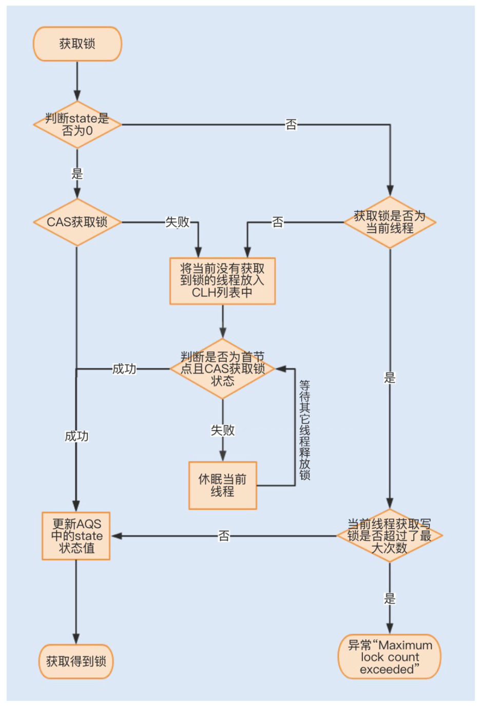

# 锁优化之升入了解Lock同步锁的优化方法

## 与Synchronized的优势
相对于需要 JVM **隐式**获取和释放锁的 Synchronized 同步锁，Lock 同步锁(以下简称 Lock 锁)需要的是**显示获取和释放锁**，这就为获取和释放锁提供了**更多的灵活性**。

Lock 锁的**基本操作**是**通过乐观锁来实现**的，但由于 Lock 锁也会在阻塞时被挂起，因此它依然**属于悲观锁**。

 
从性能方面上来说，在并发量不高、竞争不激烈的情况下， Synchronized 同步锁由于具有分级锁的优势，性能上与 Lock 锁差不多;但在高负载、高并发的情况下， Synchronized 同步锁由于竞争激烈会升级到重量级锁，性 能则没有 Lock 锁稳定。
 

 **对比**：
- 概况比较：

-- | Synchronized | Lock
---------|----------|---------
 实现方式 | JVM层实现 | Java底层代码实现
 锁的获取 | JVM隐式获取 | Lock.lock():获取锁，如被锁定则等待。 Lock.tryLock():如未被锁定才获取锁。 Lock.tryLock(long timeout,  TimeUnit unit):获取锁，如已被锁定，则最多等待timeout时间后返回获取锁的状态。Lock.lockInterruptibly()：如当前线程未被inteerup才获取锁
 锁的释放 | JVM隐式释放 | 通过Lock.unlock()，在finally中释放锁
 锁的类型 | 非公平锁、可重入 | 非公平锁、公平锁、可重入
 锁的状态 | 不可中断 | **可中断**

- **从性能上比较**：
  - 在**并发量不高、竞争不激烈**的情况下，Synchronized同步锁由于**具有分级锁的优势**（偏向、轻、重），性能上与Lock差不多。
  - 在**高负载、高并发**的情况下，Synchronized由于竞争会升级到重量级锁，性能没有Lock稳定。

## Lock锁的实现原理

Lock 是一个接口类
- 常用的实现类有：ReentrantLock、 ReentrantReadWriteLock(RRW)，它们都是依赖 AbstractQueuedSynchronizer(AQS)类实现的。

- AQS 类结构中包含一个**基于链表**实现的等待队列(CLH 队 列)，用于存储所有阻塞的线程，AQS 中还有一个 `state` 变量，该变量对 ReentrantLock 来说**表示加锁状态**。

- 通过一张图看下整个获取锁的流程：

## 锁分离优化 Lock 同步锁
- 读多写少的情况下，互斥锁就太重了，想到的优化方式：

**读写锁**（ ReentrantReadWriteLock）：
- ReentrantLock 是一个独占 锁，同一时间只允许一个线程访问，而 RRW 允许多个读线程同时访问，但不允许写线程和读线程、写线程和写线程同
时访问。
- 读写锁内部维护了两个锁，一个是用于读操作的 ReadLock，一个是用于写操作的 WriteLock。如何实现锁分离来保证共享资源的原子性？
- 