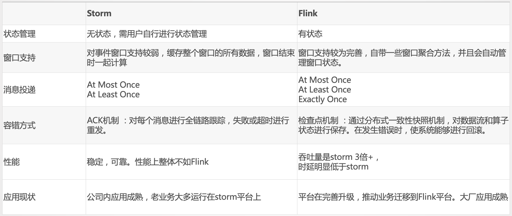

# BOBO学习Flink

# 学习资料-巨人肩膀

## 文档
- 官方文档（中文）：https://flink.apache.org/zh/

## 书籍
- 《基于Apache Flink的流处理》
- 《StreamingSystems》 英文

## 视频教程
1. https://github.com/flink-china/flink-training-course
2. 拉勾教育-flink教程

# 基础篇

**数据流上的有状态计算**

## 优势、对比
- 它的主要特性包括： 批流一体化、精密的状态管理、事件时间支持以及精确一次的状态一致性保障等。
- Flink 不仅可以运行在包括 YARN、 Mesos、Kubernetes 在内的多种资源管理框架上，还支持在裸机集群上独立部署。
- 在启用高可用选项的情况下，它不存在单点失效问题。
  >事实证明，Flink 已经可以扩展到数千核心，其状态可以达到 TB 级别，且仍能保持高吞吐、低延迟的特性。

### 流式处理框架对比：Storm、Spark Streaming

- [美团基于 Flink 的实时数仓建设实践](https://tech.meituan.com/2018/10/18/meishi-data-flink.html)
- [流计算框架 Flink 与 Storm 的性能对比](https://tech.meituan.com/2017/11/17/flink-benchmark.html)

**[美团实时计算技术选型对比](https://tech.meituan.com/2021/08/26/data-warehouse-in-meituan-waimai.html)**



以下实时计算场景建议考虑使用 Flink 框架进行计算： 
+ 要求消息投递语义为 Exactly Once 的场景； 
+ 数据量较大，要求高吞吐低延迟的场景； 
+ 需要进行状态管理或窗口统计的场

## 基础特性
**Flink自身特点：**
- 所有流式场景
   * 事件驱动应用
   * 流批分析
   * 数据管道 & ETL

* 正确性保证
  * Exactly-once 状态一致性
  * 事件时间处理
  * 成熟的迟到数据处理

* 分层 API
  * SQL on Stream & Batch Data
  * DataStream API & DataSet API
  * ProcessFunction (Time & State)

* 聚焦运维
  * 灵活部署
  * 高可用
  * 保存点

* 大规模计算
  * 水平扩展架构
  * 支持超大状态
  * 增量检查点机制

* 性能卓越
  * 低延迟
  * 高吞吐
  * 内存计算


- **流处理特性**：
  * 支持高吞吐、低延迟、高性能的流处理 
  * 支持带有事件时间的窗口(Window)操作 
  * 支持有状态计算的Exactly-once语义 
  * 支持高度灵活的窗口(Window)操作,支持基于time、count、session,以及data-driven的窗口操作 
  * 支持具有Backpressure功能的持续流模型 
  * 支持基于轻量级分布式快照(Snapshot)实现的容错 
  * 一个运行时同时支持Batch on Streaming处理和Streaming处理 
  * Flink在JVM内部实现了自己的内存管理 
  * 支持迭代计算 
  * 支持程序自动优化:避免特定情况下Shuffle、排序等昂贵操作,中间结果有必要进行缓存


**API支持**
  * 对Streaming数据类应用,提供DataStream API 
  * 对批处理类应用,提供DataSet API(支持Java/Scala) 


- **Libraries支持**
  * 支持机器学习(FlinkML) 
  * 支持图分析(Gelly) 
  * 支持关系数据处理(Table) 
  * 支持复杂事件处理(CEP) 

- **整合支持**
  * 支持Flink on YARN 
  * 支持HDFS 
  * 支持来自Kafka的输入数据 
  * 支持Apache HBase 
  * 支持Hadoop程序 
  * 支持Tachyon 
  * 支持ElasticSearch 
  * 支持RabbitMQ 
  * 支持Apache Storm 
  * 支持S3 
  * 支持XtreemFS 


## 流处理应用的基本组件

### Streams（流）
（数据）流是流处理的基本要素,Flink 是一个能够处理任何类型数据流的强大处理框架。
  - **有界流和无界流**。
    * 有界流指的是**有固定大小**，不随时间增加而增长的数据，比如我们保存在 Hive 中的一个表；
    * 而无界流指的是数据**随着时间增加而增长**，计算状态持续进行，比如我们消费 Kafka 中的消息，消息持续不断，那么计算也会持续进行不会结束。
  * 实时 和 历史记录 的数据流：所有的数据都是以流的方式产生，但用户通常会使用两种截然不同的方法处理数据。  Flink 的应用能够同时支持处理实时以及历史记录数据流。
    -  在数据生成时进行实时的处理；
    -  先将数据流持久化到存储系统中——例如文件系统或对象存储，然后再进行批处理。
  
### State（状态）
所谓的状态指的是在进行流式**计算过程中的信息**。
  * 一般用作容错恢复和持久化，**流式计算在本质上是增量计算，也就是说需要不断地查询过去的状态**。
  * 状态在 Flink 中有十分重要的作用，例如为了确保 Exactly-once 语义需要将数据写到状态中；
  * 此外，状态的持久化存储也是集群出现 Fail-over 的情况下自动重启的前提条件。
  * 只有在每一个单独的事件上进行转换操作的应用才不需要状态，换言之，每一个具有一定复杂度的流处理应用都是有状态的。

Flink 提供了许多**状态管理相关的特性支持**，其中包括：
  * **多种状态基础类型**：Flink 为多种不同的数据结构提供了相对应的状态基础类型，例如原子值（value），列表（list）以及映射（map）。开发者可以基于处理函数对状态的访问方式，选择最高效、最适合的状态基础类型。
  * 插件化的State Backend：State Backend 负责管理应用程序状态，并在需要的时候进行 checkpoint。Flink 支持多种 state backend，可以将状态存在内存或者 RocksDB。RocksDB 是一种高效的嵌入式、持久化键值存储引擎。Flink 也支持插件式的自定义 state backend 进行状态存储。
  * **精确一次语义**：Flink 的 checkpoint 和故障恢复算法保证了故障发生后应用状态的一致性。因此，Flink 能够在应用程序发生故障时，对应用程序透明，不造成正确性的影响。
  * **超大数据量状态**：Flink 能够利用其异步以及增量式的 checkpoint 算法，存储数 **TB** 级别的应用状态。
  * **可弹性伸缩的应用**：Flink 能够通过在更多或更少的工作节点上对状态进行重新分布，支持有状态应用的分布式的横向伸缩。


### Time（时间）
时间是流处理应用另一个重要的组成部分。因为事件总是在特定时间点发生，所以大多数的事件流都拥有事件本身所固有的时间语义。进一步而言，许多常见的流计算都基于时间语义，例如窗口聚合、会话计算、模式检测和基于时间的 join。流处理的一个重要方面是应用程序如何衡量时间，即区分**事件时间**（event-time）和**处理时间**（processing-time）。

Flink 提供了丰富的**时间语义支持**。
* **事件时间模式**：使用事件时间语义的流处理应用根据事件本身自带的时间戳进行结果的计算。因此，无论处理的是历史记录的事件还是实时的事件，事件时间模式的处理总能保证结果的准确性和一致性。
* **Watermark 支持**：Flink 引入了 watermark 的概念，用以衡量**事件时间**进展。Watermark 也是一种平衡处理延时和完整性的灵活机制。
* **迟到数据处理**：当以带有 watermark 的**事件时间**模式处理数据流时，在计算完成之后仍会有相关数据到达。这样的事件被称为迟到事件。Flink 提供了多种处理迟到数据的选项，例如将这些数据重定向到旁路输出（side output）或者更新之前完成计算的结果。
* **处理时间模式**：除了事件时间模式，Flink 还支持处理时间语义。**处理时间模式根据处理引擎的机器时钟触发**计算，一般适用于有着**严格的低延迟需求**，并且能够**容忍近似结果**的流处理应用。

  * Flink 支持了 Event time、Ingestion time、Processing time 等多种时间语义，
  * 时间是我们在进行 Flink 程序开发时判断业务状态是否滞后和延迟的重要依据。
### 分层API
  Flink 自身提供了三层级别的抽象来支持我们开发流式或者批量处理程序， 由上而下可分为 
  - SQL / Table API
  - DataStream API
  - ProcessFunction ，

**ProcessFunction**： Flink 所提供的**最具表达力**的接口
- 可以处理一或两条输入数据流中的单个事件或者归入一个特定窗口内的多个事件
- 它提供了对于时间和状态的细粒度控制。
- 开发者可以在其中任意地修改状态，也能够注册定时器用以在未来的某一时刻触发回调函数。
- 因此，你可以利用 ProcessFunction 实现许多**有状态**的事件驱动应用所需要的基于单个事件的复杂业务逻辑。
  >举例：如何在 KeyedStream 上利用 KeyedProcessFunction 对标记为 START 和 END 的事件进行处理。当收到 START 事件时，处理函数会记录其时间戳，并且注册一个时长4小时的计时器。如果在计时器结束之前收到 END 事件，处理函数会计算其与上一个 START 事件的时间间隔，清空状态并将计算结果返回。否则，计时器结束，并清空状态。

**DataStream API**：
- 为许多通用的流处理操作提供了处理原语，些操作包括窗口、逐条记录的转换操作，在处理事件时进行外部数据库查询等。
- DataStream API 支持 Java 和 Scala 语言，预先定义了例如map()、reduce()、aggregate() 等函数。
- 可以通过扩展实现预定义接口或使用 Java、Scala 的 lambda 表达式实现自定义的函数。
  >举例：如何捕获会话时间范围内所有的点击流事件，并对每一次会话的点击量进行计数。

```java
  // 网站点击 Click 的数据流
DataStream<Click> clicks = ...

DataStream<Tuple2<String, Long>> result = clicks
  // 将网站点击映射为 (userId, 1) 以便计数
  .map(
    // 实现 MapFunction 接口定义函数
    new MapFunction<Click, Tuple2<String, Long>>() {
      @Override
      public Tuple2<String, Long> map(Click click) {
        return Tuple2.of(click.userId, 1L);
      }
    })
  // 以 userId (field 0) 作为 key
  .keyBy(0)
  // 定义 30 分钟超时的会话窗口
  .window(EventTimeSessionWindows.withGap(Time.minutes(30L)))
  // 对每个会话窗口的点击进行计数，使用 lambda 表达式定义 reduce 函数
  .reduce((a, b) -> Tuple2.of(a.f0, a.f1 + b.f1))

```

**SQL & Table API**:Flink 的关系型 API 旨在简化数据分析、数据流水线和 ETL 应用的定义。
- Flink 支持两种关系型的 API，Table API 和 SQL。
- 这两个 API 都是批处理和流处理统一的 API，这意味着在无边界的实时数据流和有边界的历史记录数据流上，关系型 API 会以相同的语义执行查询，并产生相同的结果。
- Table API 和 SQL 借助了 Apache Calcite 来进行查询的解析，校验以及优化。
- 它们可以与 DataStream 和 DataSet API 无缝集成，并支持用户自定义的标量函数，聚合函数以及表值函数。

>如何使用 SQL 语句查询捕获会话时间范围内所有的点击流事件，并对每一次会话的点击量进行计数。此示例与上述 DataStream API 中的示例有着相同的逻辑。
```sql
SELECT userId, COUNT(*)
FROM clicks
GROUP BY SESSION(clicktime, INTERVAL '30' MINUTE), userId
```

### 库
Flink 具有数个适用于常见数据处理应用场景的扩展库。

* **复杂事件处理**(CEP)：模式检测是事件流处理中的一个非常常见的用例。
  * Flink 的 CEP 库提供了 API，使用户能够以例如正则表达式或状态机的方式指定事件模式。 
  * CEP 库与 Flink 的 DataStream API 集成，以便在 DataStream 上评估模式。
  * CEP 库的应用包括网络入侵检测，业务流程监控和欺诈检测。

* **DataSet API**：DataSet API 是 Flink 用于**批处理应用程序的核心 API**。
  * DataSet API 所提供的基础算子包括map、reduce、(outer) join、co-group、iterate等。
  * 所有算子都有相应的算法和数据结构支持，对内存中的序列化数据进行操作。
  * 如果数据大小超过预留内存，则过量数据将存储到磁盘。
  * Flink 的 DataSet API 的数据处理算法借鉴了传统数据库算法的实现，例如混合散列连接（hybrid hash-join）和外部归并排序（external merge-sort）。

* **Gelly**: Gelly 是一个可扩展的图形处理和分析库。
  * Gelly 是在 DataSet API 之上实现的，并与 DataSet API 集成。
  * 因此，它能够受益于其可扩展且健壮的操作符。

## 一些概念

### Flink 编程模型和流式处理

Flink 程序的基础构建模块是**流**（Streams）和**转换**（Transformations），每一个**数据流**起**始于**一个或多个 **Source**，并**终止于**一个或多个**Sink**。数据流类似于**有向无环图**（DAG）。

在分布式运行环境中，Flink 提出了算子链的概念，Flink 将多个算子放在一个任务中，由同一个线程执行，减少线程之间的切换、消息的序列化/反序列化、数据在缓冲区的交换，减少延迟的同时提高整体的吞吐量。

在并行环境下，Flink 将多个 operator 的子任务链接在一起形成了一个task，每个 task 都有一个独立的线程执行。

### Flink 集群模型和角色
在实际生产中，Flink 都是以集群在运行，在运行的过程中包含了两类进程。

* **JobManager**：它扮演的是集群管理者的角色，
  * 负责调度任务、协调 checkpoints、协调故障恢复、收集 Job 的状态信息，
  * 并管理 Flink 集群中的从节点 TaskManager。
* **TaskManager**：
  * 实际负责执行计算的 Worker，在其上执行 Flink Job 的一组 Task；
  * TaskManager 还是所在节点的管理员，它负责把该节点上的服务器信息比如内存、磁盘、任务运行情况等向 JobManager 汇报。
* **Client**：
  * 用户在提交编写好的 Flink 工程时，会先创建一个客户端再进行提交，这个客户端就是 Client，
  * Client 会根据用户传入的参数选择使用 yarn per job 模式、stand-alone 模式还是 yarn-session 模式将 Flink 程序提交到集群。

### Flink资源和资源组

slot仅仅用来对内存做隔离，对CPU不起作用。 共享TCP连接。

### 批处理 VS 流处理

批处理是处理有界数据流时的范例。在这种操作模式下，您可以选择在生成任何结果之前摄取整个数据集，这意味着，例如，可以对数据进行排序、计算全局统计或生成总结所有输入的最终报告。

流处理涉及无限制的数据流。至少从概念上来说，输入可能永远不会结束，因此您必须在数据到达时不断处理它。

## 应用类型

### 事件驱动型应用

事件驱动型应用是一类具有状态的应用，它从一个或多个事件流提取数据，并根据到来的事件触发计算、状态更新或其他外部动作。

事件驱动型应用是在计算存储分离的传统应用基础上进化而来。

- **在传统架构中，应用需要读写远程事务型数据库**。
- Flink中，事件驱动型应用是**基于状态化流处理**来完成。在该设计中，**数据和计算不会分离**，应用只需访问本地（内存或磁盘）即可获取数据。系统**容错性**的实现依赖于**定期向远程持久化**存储写入**checkpoint**。

**优势**：
- 事件驱动型应用无须查询远程数据库，本地数据访问使得它具有更高的吞吐和更低的延迟。
- 而由于定期向远程持久化存储的 checkpoint 工作可以异步、增量式完成，因此对于正常事件处理的影响甚微。
- 传统分层架构下，通常多个应用会共享同一个数据库，因而任何对数据库自身的更改（例如：由应用更新或服务扩容导致数据布局发生改变）都需要谨慎协调。反观事件驱动型应用，由于只需考虑自身数据，因此在更改数据表示或服务扩容时所需的协调工作将大大减少。
  >自身数据时效性？

**如何支持：**事件驱动型应用会受制于底层流处理系统对时间和状态的把控能力
- 提供了一系列丰富的状态操作原语，允许以精确一次的一致性语义合并海量规模（TB 级别）的状态数据。
- Flink 还支持事件时间和自由度极高的定制化窗口逻辑，而且它内置的 ProcessFunction 支持细粒度时间控制，方便实现一些高级业务逻辑。
- Flink 还拥有一个复杂事件处理（CEP）类库，可以用来检测数据流中的模式
- Savepoint 是一个一致性的状态映像，它可以用来初始化任意状态兼容的应用。在完成一次 savepoint 后，即可放心对应用升级或扩容，还可以启动多个版本的应用来完成 A/B 测试。

### 数据分析应用
数据分析任务需要从原始数据中提取有价值的信息和指标。

- **传统**的分析方式通常是**利用批查询**，或将事件记录下来并基于此有限数据集构建应用来完成。
  - 为了得到最新数据的分析结果，必须先将它们加入分析数据集并重新执行查询或运行应用，随后将结果写入存储系统或生成报告。
- **Flink：**
  - 借助一些先进的流处理引擎，还可以实时地进行数据分析。
  - 和传统模式下读取有限数据集不同，流式查询或应用会接入实时事件流，并随着事件消费持续产生和更新结果。
  - 仪表展示应用可以相应地从外部数据库读取数据或直接查询应用的内部状态。

**流处理优势：**
- 和批量分析相比，由于流式分析省掉了周期性的数据导入和查询过程，因此从事件中获取指标的**延迟更低**。
- 批量查询必须处理那些由定期导入和输入有界性导致的人工数据边界，而流式查询则无须考虑该问题。
- 流式分析会简化应用抽象。批量查询的流水线通常由多个独立部件组成，需要周期性地调度提取数据和执行查询。如此复杂的流水线操作起来并不容易，一旦某个组件出错将会影响流水线的后续步骤。

**如何支持：**
- 它内置了一个符合 ANSI 标准的 SQL 接口，将批、流查询的语义统一起来。无论是在记录事件的静态数据集上还是实时事件流上，相同 SQL 查询都会得到一致的结果。
-  Flink 还支持丰富的用户自定义函数，允许在 SQL 中执行定制化代码。
-  可以利用 Flink DataStream API 和 DataSet API 进行更低层次的控制。
-  Flink 的 Gelly 库为基于批量数据集的大规模高性能图分析提供了算法和构建模块支持。

### 数据管道应用

### 什么是数据管道？
提取-转换-加载（ETL）是一种在存储系统之间进行数据转换和迁移的常用方法。
ETL 作业通常会周期性地触发，将数据从事务型数据库拷贝到分析型数据库或数据仓库。

数据管道和 ETL 作业的用途相似，都可以转换、丰富数据，并将其从某个存储系统移动到另一个。
- 但数据管道是以持续流模式运行，而非周期性触发。
- 因此它支持从一个不断生成数据的源头读取记录，并将它们以低延迟移动到终点。
>例如：数据管道可以用来监控文件系统目录中的新文件，并将其数据写入事件日志；另一个应用可能会将事件流物化到数据库或增量构建和优化查询索

#### 数据管道的优势？
和周期性 ETL 作业相比，持续数据管道可以**明显降低将数据移动到目的端的延迟**。此外，由于它能够持续消费和发送数据，因此**用途更广，支持用例更多**。

#### Flink 如何支持数据管道应用？
很多常见的数据转换和增强操作可以利用 Flink 的 SQL 接口（或 Table API）及用户自定义函数解决。
- 如果数据管道有更高级的需求，可以选择更通用的 DataStream API 来实现。
- Flink 为多种数据存储系统（如：Kafka、Kinesis、Elasticsearch、JDBC数据库系统等）内置了连接器。
- 同时它还提供了文件系统的连续型数据源及数据汇，可用来监控目录变化和以时间分区的方式写入文件。

- 典型的数据管道**应用实例**
  * 电子商务中的实时查询索引构建
  * 电子商务中的持续 ETL

## 同类技术对比

### Flink Vs Spark

**相同点**：
- 都基于内存计算；
- 都有统一的批处理和流处理 API，都支持类似 SQL 的编程接口；
- 都支持很多相同的转换操作，编程都是用类似于 Scala Collection API 的函数式编程模式；
- 都有完善的错误恢复机制；
- 都支持 Exactly once 的语义一致性。

**不同点**，可以从 4 个不同的角度来看：
- 从**流处理的角度**来讲，
  - Spark 基于微批量处理，把流数据看成是一个个小的批处理数据块分别处理，所以延迟性只能做到秒级。
  - 而 Flink 基于每个事件处理，每当有新的数据输入都会立刻处理，是真正的流式计算，支持毫秒级计算。
  - 由于相同的原因，Spark 只支持基于时间的窗口操作（处理时间或者事件时间），
  - 而 Flink 支持的窗口操作则非常灵活，不仅支持时间窗口，还支持基于数据本身的窗口，开发者可以自由定义想要的窗口操作。

- 从 SQL 功能的角度来讲，Spark 和 Flink 分别提供 SparkSQL 和 Table API 提供 SQL 交互支持。两者相比较，Spark 对 SQL 支持更好，相应的优化、扩展和性能更好，而 Flink 在 SQL 支持方面还有很大提升空间。

- 从迭代计算的角度来讲，Spark 对机器学习的支持很好，因为可以在内存中缓存中间计算结果来加速机器学习算法的运行。但是大部分机器学习算法其实是一个有环的数据流，在 Spark 中，却是用无环图来表示。而 Flink 支持在运行时间中的有环数据流，从而可以更有效的对机器学习算法进行运算。从相应的生态系统角度来讲，Spark 的社区无疑更加活跃。Spark 可以说有着 Apache 旗下最多的开源贡献者，而且有很多不同的库来用在不同场景。而 Flink 由于较新，现阶段的开源社区不如 Spark 活跃，各种库的功能也不如 Spark 全面。但是 Flink 还在不断发展，各种功能也在逐渐完善。小结


对于以下场景，你可以选择 Spark。数据量非常大而且逻辑复杂的批数据处理，并且对计算效率有较高要求（比如用大数 据分析来构建推荐系统进行个性化推荐、广告定点投放等）；基于历史数据的交互式查询，要求响应较快；基于实时数据流的数据处理，延迟性要求在在数百毫秒到数秒之间。Spark 完美满足这些场景的需求， 而且它可以一站式解决这些问题，无需用别的数据处理平台。

由于 Flink 是为了提升流处理而创建的平台，所以它适用于各种需要非常低延迟（微秒到毫秒级）的实时数据处理场景，比如实时日志报表分析。而且 Flink 用流处理去模拟批处理的思想，比 Spark 用批处理去模拟流处理的思想扩展性更好，所以我相信将来 Flink 会发展的越来越好，生态和社区各方面追上 Spark。

#### Storm

# 架构

## 运维

Flink通过几下多种机制维护应用可持续运行及其一致性:
* **检查点的一致性**: Flink的故障恢复机制是通过建立分布式应用服务状态一致性检查点实现的，当有故障产生时，应用服务会重启后，再重新加载上一次成功备份的状态检查点信息。结合可重放的数据源，该特性可保证精确一次（exactly-once）的状态一致性。
  
* **高效的检查点**: 如果一个应用要维护一个TB级的状态信息，对此应用的状态建立检查点服务的资源开销是很高的，为了减小因检查点服务对应用的延迟性（SLAs服务等级协议）的影响，Flink采用异步及增量的方式构建检查点服务。
  
* **端到端的精确一次**: Flink 为某些特定的存储支持了事务型输出的功能，及时在发生故障的情况下，也能够保证精确一次的输出。
  
* **集成多种集群管理服务**: Flink已与多种集群管理服务紧密集成，如 Hadoop YARN, Mesos, 以及 Kubernetes。当集群中某个流程任务失败后，一个新的流程服务会自动启动并替代它继续执行。
  
* **内置高可用服务**: Flink内置了为解决单点故障问题的高可用性服务模块，此模块是基于Apache ZooKeeper 技术实现的，Apache ZooKeeper是一种可靠的、交互式的、分布式协调服务组件

### Flink检查点算法
Flink会周期性地为应用状态生成检查点，一旦发生故障，Flink会利用最新的检查点将应用状态恢复到某个一致性的点，并重启处理进程。
- 只有所有输入流都是来自于可重置的数据源，应用才能支持精确一次的状态一致性
- 虽然有些消息会被重复处理，但是所有算子会重置到过去还没处理过那些数据的时间点，还是能保证精确一次。

停止一切的检查点算法是不实用的。
- Flink的检查点是基于Chandy-Lamport分布式快照算法来实现的，该算法不会暂停整个应用，而是会把生成检查点的过程和处理数据过程分离， 这样在部分任务持久化状态的过程中，其他任务还可以继续执行。
- 会用到一类名为检查点分割符的特殊记录。

### 保存点

**保存点区别于检查点：**

可以看做是包含一些额外元数据的检查点。 可以做很多事情：
- 启动一个不同但相互兼容的应用。便于升级应用服务版本。
  >故障恢复（检查点）会在完全相同的集群上，以完全相同的配置，运行完全相同的应用。
- 用不同并行度启动原应用，从而实现应用的**扩容**
- 在另一个集群上启动相同应用。 用于迁移新版本，或者一个不同的集群或数据中心。
- 便于A/B测试及假设分析场景对比结果
- 暂停某个应用，稍后再把它启动起来。
- 为保存点设置不同版本并将应用状态归档。

**从保存点启动应用**

### 监控和控制应用服务

持续运行的流应用服务也需要监控及集成到一些基础设施资源管理服务中，例如一个组件的监控服务及日志服务等。
- 监控服务有助于预测问题并提前做出反应，
- 日志服务提供日志记录能够帮助追踪、调查、分析故障发生的根本原因。
- 最后，便捷易用的访问控制应用服务运行的接口也是Flink的一个重要的亮点特征。

* **Web UI方式**: Flink提供了一个web UI来观察、监视和调试正在运行的应用服务。并且还可以执行或取消组件或任务的执行。
* **日志集成服务**:Flink实现了流行的slf4j日志接口，并与日志框架log4j或logback集成。
* **指标服务**: Flink提供了一个复杂的度量系统来收集和报告系统和用户定义的度量指标信息。度量信息可以导出到多个报表组件服务，包括 JMX, Ganglia, Graphite, Prometheus, StatsD, Datadog, 和 Slf4j.
* **标准的WEB REST API接口服务**: Flink提供多种REST API接口，有提交新应用程序、获取正在运行的应用程序的Savepoint服务信息、取消应用服务等接口。REST API还提供元数据信息和已采集的运行中或完成后的应用服务的指标信息。


# DataSteam API

## 富函数

多了两个方法：
- open()
- close()

**作用**： 做一些初始化工作，或者取得函数执行相关上下文信息。已Rich开头

## 导入外部依赖

**为什么要导入？**
 - 为了尽可能自身的外部依赖，flink集群只会加载核心API依赖，对于应用的其他依赖必须显式提供

**如何保证执行应用时可以访问到所有依赖？**
 - 将全部依赖打进应用的jar包。 这样生成的独立jar包会很大
 - 可以将依赖的jar包放到设置Flikn的 `./lib` 目录中。 这样在Flink经常启动时就会将依赖加载到classpath中。
    >这样加入classpath的依赖会对同一Flink环境中所有运行的应用可见。可能会造成干扰。
    >推荐使用“胖Jar”的方式部署


# 基于时间和窗口的算子

## 如何定义时间特性

- ProcessingTime：指定算子根据处理机器的系统时钟决定数据流当前的时间。
- EventTime
- IngestionTime


## 时间戳

## 水位线

## 核心窗口API

类型，自定义窗口操作，核心结构（分配器、触发器和移除器）