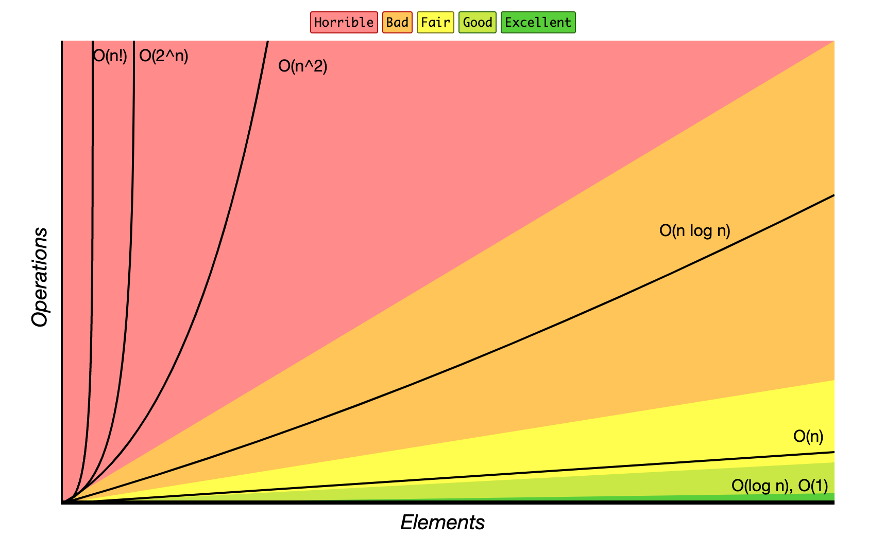
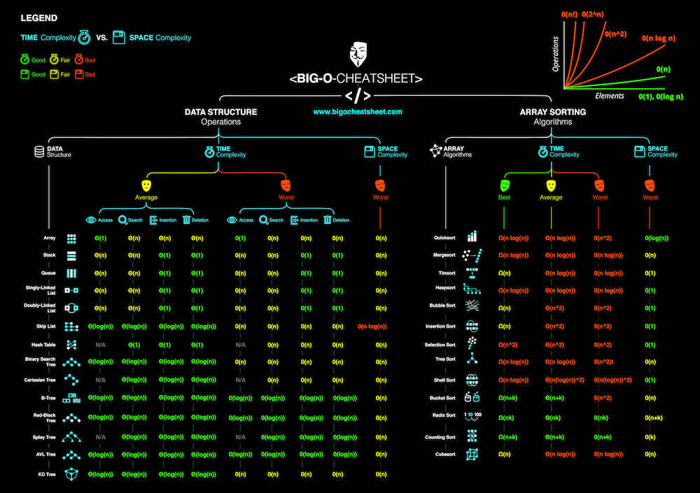
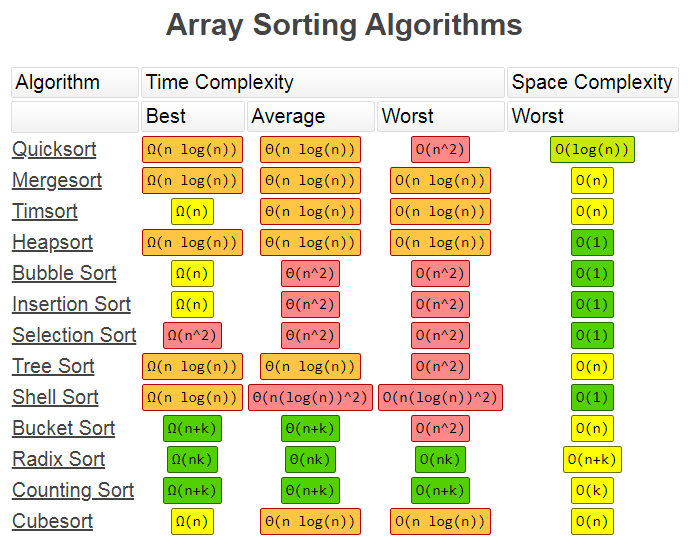

# 数据结构基础

## 学习方法

1. 形成只是脉络-主干，然后把其他知识挂上去，记得牢靠
2. 学习不擅长的骨头，需要刻意反复练习，刚开始是难受的，需要一个过程，慢慢变好。一个曲线 
3. 坚持、可以练习，自己不擅长的，痛苦的题目：动态规划、搜索、回溯

**分类**：
- **数据结构**：
  - Array
  - Stack/Queue
  - PriorityQueue(heap)
  - LinkedList(single/double)
  - Tree/Binary Tree
  - HashTable
  - Disjoint Set
  - Trie
  - BloomFilter
  - LRU Cache
- **算法**：
  - General Coding
  - In-order/Pre-order/Post-order traversal
  - Greedy
  - Recursion/Backtrace
  - Breadth-first search
  - Depth-first search
  - Divide and Conquer
  - Dynamic Programming
  - Binary Search
  - Graph


[下面图片参考链接](https://www.bigocheatsheet.com/)


**时间复杂度**：
O(1)、N、logN、



数据结构的访问-插入删除的时间复杂度：


**空间复杂度**：

总体图：



## 数组&链表

- 数组： 随机访问，插入删除复杂度过高。 访问为主的用这个
- 链表： 插入删除复杂度O(1)
  - 插入删除操作频繁用链表
  - 不清楚大小的也可以用这个

列表排序时间复杂度：



**链表**的题目，思维不难，难的是代码基本功，很绕，容易出错
- 反转链表
- 反转相邻节点
- 给定链表，判断是否有环。


 ## 栈和队列

 - 栈：先入先出
 - 队列：先入后出


栈常见题目：
- 匹配括号
- 用两个栈实现队列


队列常见题目：
- 用2个队列实现栈
- 用一个队列实现栈


### 堆


- 703 第K大的元素


239. 滑动窗口最大值


### Map 和 Set


1. 两数和    15. 3数之和   18、 四数之和


### tree  和 graph

- 102 按层输出
- 104/111 max/min depth
- 22. 生成括号
- 235.二叉树/236.二叉搜索树上两个节点最近公共祖先
- 98.验证二叉搜索树


### 剪枝
51/52 N皇后问题


36/37  数独

### 递归

50. x的n次方

169. 找出众数，出现次数超过2/n的数

122. 买卖股票


### 二分查找

1. 要求数组有序
2. 要求数组明确上下界
3. 能够通过索引访问

69 题：求y的根号2值， 二分法、牛顿迭代法


### Trie树

208. 实现一个Trie树


79
212


### 位运算

191 x&(x-1)
231/338

52 N皇后&位运算


### 动态规划

- 递推（递归+记忆化）
- 状态的定义：opt[n],dp[n],fib[n]
- 状态转移方程：opt[n]=best_of(opt[n-1], opt[n-2],...)
- 最优子结构


**DP vs 回溯 vs 贪心**：

- 回溯（递归）——重复计算
- 贪心 —— 永远局部最优
- 动态规划—— 记录局部最优子结构、多种记录值


- 70 爬楼梯
- 120 三角
- 152  相乘最大数
- 121/122/123、309,188,714 股票
- 300 最长递增子序列
- 322  coin
- 72 编辑次数， 特别经典


### 并查集
- 200 islands
- 547 朋友圈


### LRU Cache 
缓存替换算法

LFU- 最近最不常使用频率

- 146题

### 布隆过滤器

多个hash函数， 不在就肯定不在，在可能误报。 
bitcoin判断交易在哪个块里


## 面试

### 代码模板

**递归**
- 满足三个条件
  - 大问题拆成2个子问题
  - 子问题求解方式跟大问题一样
  - 存在最小子问题

```java
//terminator 终止条件

// process

// drill down 进入下一层

// clear states还原一些影响

```

**DP**

```java
// DP formula

```


### 面试
1. 持续练习、刻意练习。 切题爽，但是切到一定阶段，要刻意去练习自己不太熟悉的数据结构和类型题目。
2. 面试四件套：
   1. 确认细节：询问题目细节，边界条件，极端情况
   2. 所有的解法都和面试官沟通一遍，当做同事探讨问题，而不是监考老师。 然后选择一种最快或者省空间，或者最优雅的解法
   3. Code
   4. Test Case


## 最后的最后

- 3分学7分练
- 环境准备
- 切题姿势：
  - 120题三角形：递归、dp


## 字节跳动热门题库

- [x] 1 两数之和（Two Sum）
- [x] 3 最长无重复子串（Longest Substring Without Repeating Characters）
- [x] 4 **寻找两个正序数组的中位数**（Median of Two Sorted Arrays）
- [x] 5 **最长回文子串**（Longest Palindromic Substring） xxx
- [ ] 8 字符串转换整数 (atoi)
- [x] 11 盛最多水的容器（Container With Most Water）
- [ ] 14 最长公共前缀
- [ ] 15. 三数之和
- [ ] 12 矩阵中的路径
- [ ] 20 有效的括号
- [x] 23 **合并K个排序链表**（Merge k Sorted Lists）
- [x] 43 字符串相乘（Multiply Strings） x
- [ ] 55 跳跃游戏
- [ ] 53 最大子序和
- [x] 64 最小路径和
- [x] 70 **爬楼梯**
- [x] 76 最小覆盖子串（Minimum Window Substring）
- [ ] 88 合并两个有序数组
- [ ] 94 二叉树的遍历（前序、中序、后序、层次遍历）


- [ ] 104 二叉树的最大深度
- [ ] 110 平衡二叉树
- [ ] 111 二叉树的最小深度
- [ ] 121 买卖股票的最佳时机

- [ ] 153 寻找旋转排序数组中的最小值

- [ ] 155 最小栈
- [ ] 159 无重复字符的最长子串（Longest Substring with At Most Two Distinct Characters）
- [ ] 146 LRU缓存机制
- [ ] 160 相交链表
- [ ] 198 打家劫舍
- [ ] 200 岛屿问题
- [ ] 206 **反转链表**  xx
- [ ] 236 二叉树的公共祖先
- [ ] 239 滑动窗口最大值
- [ ] 300 最长上升子序列
- [ ] 322 零钱兑换
- [ ] 347 前 K 个高频元素
- [ ] leetcode 373. 查找和最小的 K 对数. 要求讲出时间复杂度
- [ ] 435 无重叠区间（Non-overlapping Intervals）
- [ ] 567 字符串的排列
- [ ] 621 任务调度器
- [ ] 704 二分查找
- [ ] 912 **快排**  归并排序 堆排序  xx
- [ ] 1143 最长公共子序列

- [ ] 一道leetcode，给20-30分钟：
- [ ] n个骰子的点数和为k的概率
- [ ] 实现LFU算法，有时间复杂度要求


- [ ] 题目：思路：略微更改了一下原题，给出的题目其实是查找和最大的K对，是一道leetcode中等难度。算是经典的多路归并问题。

这里给一些类似的题目可以学习一下多路归并：
1. 丑数 II
2. 超级丑数
3. 查找和最小的K对数字
4. 最小区间
5. 找出第 k 小的距离对
6. 第 K 个最小的素数分数
7. 有序矩阵中的第 k 个最小数组和
8. 子数组和排序后的区间和
9. 数组的最小偏移量

堆排序的时间复杂度、空间复杂度、排序的的过程。
