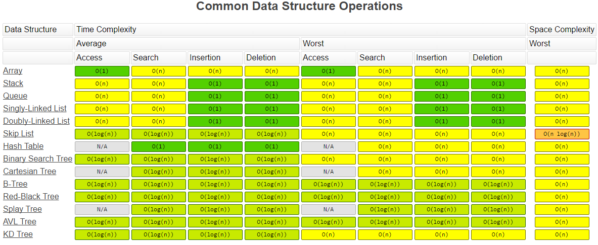

# 数据结构基础

## 学习方法

1. 形成只是脉络-主干，然后把其他知识挂上去，记得牢靠
2. 学习不擅长的骨头，需要刻意反复练习，刚开始是难受的，需要一个过程，慢慢变好。一个曲线 

**分类**：
- **数据结构**：
  - Array
  - Stack/Queue
  - PriorityQueue(heap)
  - LinkedList(single/double)
  - Tree/Binary Tree
  - HashTable
  - Disjoint Set
  - Trie
  - BloomFilter
  - LRU Cache
- **算法**：
  - General Coding
  - In-order/Pre-order/Post-order traversal
  - Greedy
  - Recursion/Backtrace
  - Breadth-first search
  - Depth-first search
  - Divide and Conquer
  - Dynamic Programming
  - Binary Search
  - Graph

[下面图片参考链接](https://www.bigocheatsheet.com/)

**时间复杂度**：
O(1)、N、logN、

数据结构的访问-插入删除的时间复杂度：

**空间复杂度**：

总体图：

## 数组&链表

- 数组： 随机访问，插入删除复杂度过高。 访问为主的用这个
- 链表： 插入删除复杂度O(1)
  - 插入删除操作频繁用链表
  - 不清楚大小的也可以用这个

列表排序时间复杂度：

链表的题目，思维不难，难的是代码基本功，很绕，容易出错

 ## 栈和队列

 - 栈：先入先出
 - 队列：先入后出

栈常见题目：
- 匹配括号
- 用两个栈实现队列

队列常见题目：
- 用2个栈实现队列
- 

