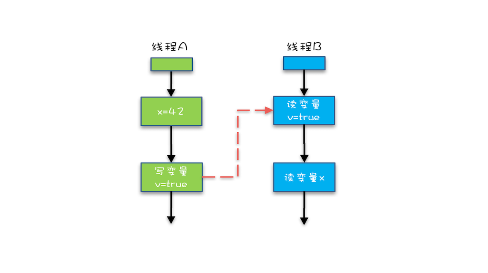

## 02 Java内存模型：看Java如何解决可见性和有序性问题

导致可见性的原因是缓存，导致有序性的原因是编译优化，那解决可见性、有序性最直接的办法就是禁用缓存和编译优化，但是这样问题虽然解决了，我们程序的性能可就堪忧了。


合理的方案应该是按需禁用缓存以及编译优化。

- 对于并发程序，何时禁用缓存以及编译优化只有程序员知道，那所谓“按需禁用”其实就是指按照程序员的要求来禁用。
- 所以，为了解决可见性和有序性问题，只需要**提供**给程序员**按需禁用缓存和编译优化的方法**即可.


Java 内存模型规范了 JVM 如何提供按需禁用缓存和编译优化的方法。具体来说，这些方法包括 volatile、synchronized 和 final 三个关键字，以及六项 Happens-Before 规则.


### Happens-Before规则


含义： 前面一个操作的结果对后续操作是可见的。

Happens-Before 约束了编译器的优化行为，虽允许编译器优化，但是要求编译器优化后一定遵守 Happens-Before 规则。

**示例代码**

场景： 假设线程 A 执行 writer() 方法，按照 volatile 语义，会把变量 “v=true” 写入内存；假设线程 B 执行 reader() 方法，同样按照 volatile 语义，线程 B 会从内存中读取变量 v，如果线程 B 看到 “v == true” 时，那么线程 B 看到的变量 x 是多少呢？

要看 Java 的版本，如果在低于 1.5 版本上运行，x 可能是 42，也有可能是 0；如果在 1.5 以上的版本上运行，x 就是等于 42。
   
```java

// 以下代码来源于【参考1】
class VolatileExample {
  int x = 0;
  volatile boolean v = false;
  public void writer() {
    x = 42;
    v = true;
  }
  public void reader() {
    if (v == true) {
      // 这里x会是多少呢？
    }
  }
}
```


1. **程序的顺序性规则**

指在一个线程中，按照程序顺序，前面的操作 Happens-Before 于后续的任意操作。

程序前面对某个变量的修改一定是对后续操作可见的。


2. **volatile 变量规则**

这条规则是指对一个 volatile 变量的写操作， Happens-Before 于后续对这个 volatile 变量的读操作。——这怎么看都是禁用缓存的意思啊，貌似和 1.5 版本以前的语义没有变化啊？如果单看这个规则，的确是这样，但是如果我们关联一下，就有点不一样的感觉了。


特性： **传递性**

这条规则是指如果 A Happens-Before B，且 B Happens-Before C，那么 A Happens-Before C。



从图中，我们可以看到：
- “x=42” Happens-Before 写变量 “v=true” ，这是规则 1 的内容；
- 写变量“v=true” Happens-Before 读变量 “v=true”，这是规则 2 的内容。
- 根据传递性：“x=42” Happens-Before 读变量“v=true”。 
  —— 这意味着：如果线程 B 读到了“v=true”，那么线程 A 设置的“x=42”对线程 B 是可见的。也就是说，线程 B 能看到 “x == 42”。

>这就是 1.5 版本对 volatile 语义的增强，这个增强意义重大，1.5 版本的并发工具包（java.util.concurrent）就是靠 volatile 语义来搞定可见性的


3. **管程中锁的规则**

对一个锁的解锁 Happens-Before 于后续对这个锁的加锁。


**管程**是一种通用的同步原语，在 Java 中指的就是 synchronized，synchronized 是 Java 里对管程的实现。

管程中的锁在 Java 里是隐式实现的，例如下面的代码，在进入同步块之前，会自动加锁，而在代码块执行完会自动释放锁，加锁以及释放锁都是编译器帮我们实现的。

```java
synchronized (this) { //此处自动加锁
  // x是共享变量,初始值=10
  if (this.x < 12) {
    this.x = 12; 
  }  
} //此处自动解锁
```


4. **线程 start() 规则**

这条是关于线程启动的。

它是指主线程 A 启动子线程 B 后，子线程 B 能够看到主线程在启动子线程 B 前的操作。

如果线程 A 调用线程 B 的 start() 方法（即在线程 A 中启动线程 B），那么该 start() 操作 Happens-Before 于线程 B 中的任意操作。


**看代码好理解**

```java
Thread B = new Thread(()->{
  // 主线程调用B.start()之前
  // 所有对共享变量的修改，此处皆可见
  // 此例中，var==77
});
// 此处对共享变量var修改
var = 77;
// 主线程启动子线程
B.start();
```


5. **线程 join() 规则**

这条是关于线程等待的。

它是指主线程 A 等待子线程 B 完成（主线程 A 通过调用子线程 B 的 join() 方法实现），当子线程 B 完成后（主线程 A 中 join() 方法返回），主线程能够看到子线程的操作。

>所谓的“看到”，指的是对共享变量的操作。


6. **线程中断规则**

对线程interrupt()方法的调用先行发生于被中断线程的代码检测到中断事件的发生，可以通过Thread.interrupted()方法检测到是否有中断发生。

7. **对象终结规则**

一个对象的初始化完成(构造函数执行结束)先行发生于它的finalize()方法的开始。


**Java内存模型底层怎么实现的？**


主要是通过内存屏障(memory barrier)禁止重排序的，即时编译器根据具体的底层体系架构，将这些内存屏障替换成具体的 CPU 指令。

对于编译器而言，内存屏障将限制它所能做的重排序优化。

而对于处理器而言，内存屏障将会导致缓存的刷新操作。

>比如，对于volatile，编译器将在volatile字段的读写操作前后各插入一些内存屏障。


### 被我们忽视的 final

**final 修饰变量时，初衷是告诉编译器：这个变量生而不变，可以可劲儿优化。**

优化错了：问题类似于上一期提到的利用双重检查方法创建单例，构造函数的错误重排导致线程可能看到 final 变量的值会变化。

当然了，在 1.5 以后 Java 内存模型对 final 类型变量的重排进行了约束。现在只要我们提供正确构造函数没有“逸出”，就不会出问题了。

>**逸出**: 指的是对封装性的破坏。比如对一个对象的操作，通过将这个对象的this赋值给一个外部全局变量，使得这个全局变量可以绕过对象的封装接口直接访问对象中的成员，这就是逸出。


在现实世界里，如果 A 事件是导致 B 事件的起因，那么 A 事件一定是先于（Happens-Before）B 事件发生的，这个就是 Happens-Before 语义的现实理解。


在 Java 语言里面，Happens-Before 的语义本质上是一种可见性，A Happens-Before B 意味着 A 事件对 B 事件来说是可见的，无论 A 事件和 B 事件是否发生在同一个线程里。

>例如 A 事件发生在线程 1 上，B 事件发生在线程 2 上，Happens-Before 规则保证线程 2 上也能看到 A 事件的发生。